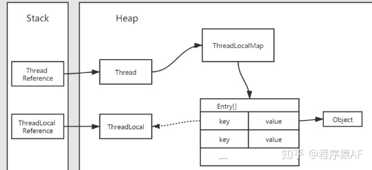
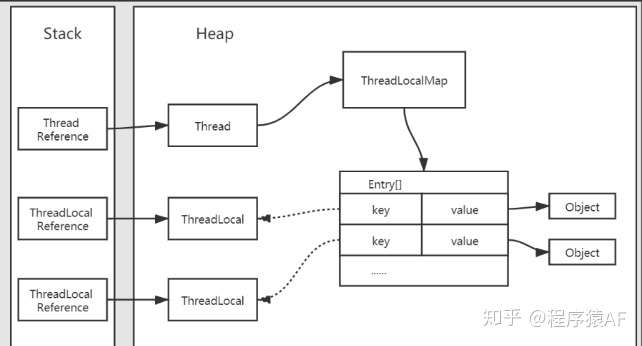
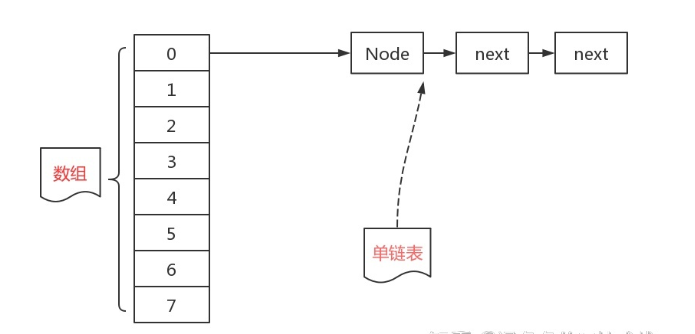
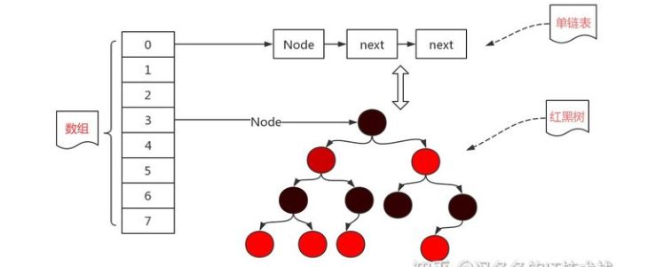
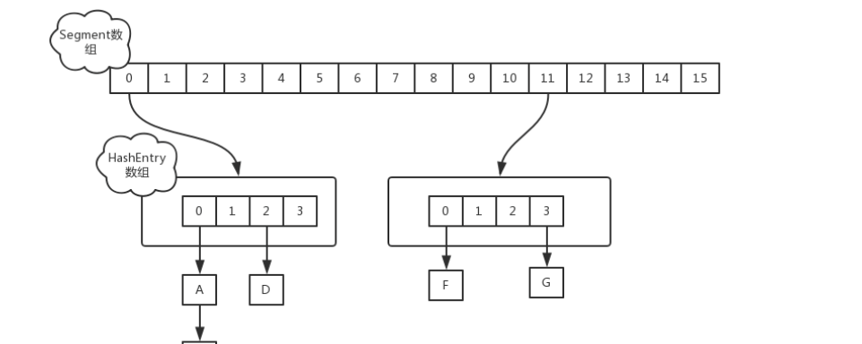
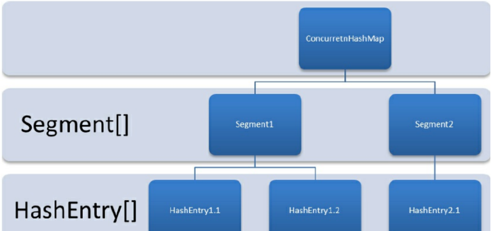

## 为什么使用private static final
<pre>
private 表明属性、方法是私有的 是public protected private default四个访问权限修饰之一
</pre>
|修饰符|访问权限|
|-----|-------|
|private|  只允许在定义类中访问使用，子类、同包目录、均不允许访问|
|protected| 允许定义类、子类访问使用，同包目录下非子类不允许访问|
|default| 不添加修饰符的默认是default，允许定义类、子类、同包名下访问|
|public |对访问权限控制最小，允许所有类访问|

<pre>
static 表明归属并非对象或者某一个类，属于对象公有，static块可以出现任何地方除了方法内部，在类加载的时候便会加载
static属性块
</pre>
<pre>
final 表明被修饰的变量不可修改，类加载时被初始化，会随着对象创建而创建加载，修饰变量只加载一次，之后变不再
重新加载初始化，此处不允许修改是不允许修改变量的内存地址，内存地址里面存的东西依然允许修改.for一个zample
class A{
 private String name;
 public A(String name){
  this.name=name;
 }
 public void setName(name){
  this.name=name;
 }
}
class B{
 private final A a=new A("final A");
 private void changeAName(String changeName){
  a.setName(changeName);
 }
}
上面的修改是允许的，它没有修改final变量的引用地址。

final修饰方法时，被修饰的方法是不允许重写的，final修饰的方法比普通方法要快，因其在编译期就被绑定了，
不需要在运行期进行动态绑定，通常final修饰的类功能都是完整的 String、Integer
</pre>

### **这里不妨简单说一下static与final**


|修饰符  |说明 |
|-------|-------|
|static |修饰的变量只会被加载一次，且是类初始化时加载，与定义对象的创建无关 |
|final|同样只加载一次，加载时机在static后，在构造方法结束前。|
<pre>
加载时机在构造方法前可以这样理解，单考虑基本类型，单独用final修饰，未与static一起修饰的属性正常来说是
需要赋予初始变量值的，任何使用到该属性的地方，只要不是赋值，便是访问使用，而该属性又只是一个成员变量
不能像static变量那样使用，所以在使用前必须要有对象，以此推，得出结论，单独final修饰的属性加载时机是
静态方法后、构造方法前的，且 final修饰的属性会随着类对象的创建而创建初始化

ps:那么回到问题 为什么使用private static final?
此修饰我们常见与Logger，以此为例，log 我们即便是对于不同的对象，但由于是同一类，我们用static修饰；不希望子类或其他类继承访问
我们加上private，再一个是在打印过程中，我们不希望该log被替换为其它log或者重新set了某些奇怪的属性，我们加上final
</pre>

## **Java流（这个比较麻烦不展开）**

<pre>
1.根据流是否直接与某些特定地方（磁盘、外接、外设）相接 可分为节点流|处理流
    节点流：读取特定节点数据 FileReader，FileInputStream，FileReader=new FileReader(new File("file.txt")); 它要求给他操作的地方
    处理流：对节点流的一些方法进行封装，对外提供一些更为符合处理的方法，BufferedReader bfr=new BufferedReader(new FileReader("file.txt"));bufferedReader相对来说增加了缓冲区
2.字符流与字节流
    字节流：字节流(Byte)按字节读写，字符流(Character)按字符读取。所有字符流能读取的流文件，字节流都能读取，字节流属于
全能流，能读取任意二进制流文件，字符流有只能读取字符的限制。所有以Stream结尾的类都属于字节流
    字符流：所有以Reader/Writer结尾的类都属于字符流，字符流增加了一个缓冲区，以此为中介，提高了读写流文件的效率，好处就说多了个缓冲区，缺点就是没有flush的话可能导致写操作白给。
           
</pre>

## **一点点的jvm**

<pre>
内存模型：
  按线程资源共享非共享：
线程共享区域： 堆、方法区（常量池也在此）
线程非共享区域：栈（包括本地方法栈）、程序计数器
ps：共享区内存问题通常是OutOfMemory；独占区有时不同，单线程下独占区内存问题抛OutOfMemory异常，多线程下抛的是StackOutFlowError

各区域存放什么东西：
堆：存放对象，所有new出来的对象都存放于此，包括数组。

方法区：又称非堆，存放常量、静态变量、静态常量、静态代码块。以及已经被JVM加载好的类信息，如字节码、field、class、method此外常量池也在此永久代
ps：说说非堆区中存放的字节码吧，此处牵扯到类加载的过程，一个类首先将字节码加载进jvm中，可以说class文件格式也可以是cglib框架生成的。
class/field/method属于元数据，字节码加载到jvm后，jvm根据其中内容为该类生成对应对象，反射使用的较多，此类生成的对象不在堆中而在方法区中。

永久代：tenure，jdk7后就不存在这一说法了,jdk7后永久代被取代部分数据存入堆中，jdk8后被元空间取代，本质上是一个东西，不过元空间是不属于jvm内存的
属于本地内存。

常量池：类字节码加载时会解析生成不同的内容存到方法区中，内容包括：字段、方法、接口、版本等信息。常量池在方法区中用于存放字节码中使用到的字面量及字符
引用，类加载时这类字符进入常量池存放，常量池相对较动态，类加载时可以写、程序运行时也可以写。

栈：Java中方法的运行实际上是方法代码栈帧在jvm中出栈入栈的过程，栈又称虚拟机栈，存放函数中定义的变量，包括引用类型和基本类型。基本类型：boolean、byte、char、float、double、int、
short、long本地方法栈：与栈无差异，本地方法栈特指Java中native方法而已

上述栈由jvm在函数（方法）运行时创建，存放局部变量，操作数栈以及常量池引用其它引用

程序计数器：PC用于指示当前程序运行到何处。
ps：所有对象包括数组都在堆上分配内存，线程共享，栈存放对对象的引用，线程独立，这样节省内存且方便垃圾回收。

</pre>

## JVM JDK JRE

## **JVM** 
<pre>
  Java虚拟机是指运行Java字节码的虚拟机，jvm有针对不同系统的特定实现的jvm，目的是保证相同字节码解析出来的是相同的结果。什么是字节码，字节码好处是什么?
Java中jvm可以理解的代码就叫做`字节码`(文件扩展名为.class)，它不面向任何特定处理器，因此Java在不同平台上无需重复编译，字节码只面向虚拟机，Java语言通过
字节码的方式在一定程度上解决传统解释型语言执行效率低的问题，且由于jvm的存在是的Java保留了可移植性。
  Java程序从源代码到运行一般有三步：.java文件--jdk中Javac编译-->>.class文件(jvm可理解的文件)--jvm-->>机器可执行的二进制机器码。字节码到机器码这一步需要
jvm先加载字节码文件再通过解释器解释执行，会比较慢，且有些代码是常需要被调用的(即热点代码)，所以后来引入了JIT编译器，JIT属于运行时编译，当JIT完成一次编译后
其会将字节码对应的机器码保存，下次直接使用，所以Java又被说是编译与解释共存的语言。
  小结：jvm是运行Java字节码的虚拟机，针对不同操作系统Java有不同的jvm实现，目的是保证使用相同字节码得到的结果是相同的，字节码与不同的jvm是保证Java一次编译
到处运行的关键。
</pre>

## **JDK与JRE**
<pre>
JDK：Java Development kit，是功能齐全的Java SDK，包含JRE拥有的一切，还有编译器javac和工具jdb、javadoc等。能创建和编译程序。

JRE：Java Runtime Environment，Java运行环境，是运行已编译Java程序所需全部内容的集合，包括jvm，Java类库bin，Java命令和其它基础构建，但无法用于创建新的程序。

即：如果只为运行Java程序，安装JRE即可，如果需要编写Java文件进行开发 则需要安装JDK。但是凡是不是那么绝对，要使用jsp部署web应用的时候也需要安装JDK，因为应用服务器
会将jsp转化为Java Servlet，Servlet是Java文件 需要编译成class文件
</pre>

## **Java编译与解释并存**
<pre>
  高级编程语言按程序执行方式分编译型和解释型两种，简单来说，编译型是指编译器针对特定操作系统将源代码一次性翻译成平台可执行的机器码(Java中平台便指jvm)；
解释型是指解释器对源程序逐行解释成特定平台机器码并立刻执行。
</pre>

## **Java和C++**
<pre>
  二者都是面向对象的，且均支持封装、继承、多态
  Java不提供指针访问内存，程序内存更安全
  Java类是单继承，接口可以多继承；C++类可以多继承；多继承相同的方法话会产生二义性，C++中通过虚继承解决
  Java有垃圾回收机制GC，不需要开发人员手动释放内存
  C++在重载方面同时支持方法重载和操作符重载，但Java只支持方法重载(操作复重载增加了复杂性，不符合Java设计思想)
</pre>

## **import java 与 import javax **
<pre>
一开始JavaAPI所必需的包是Java开头的包，javax只作为扩展API来使用，但随着时间推移，javax逐渐发展为JavaAPI中的一部分，但是移动javax包中的代码又过于麻烦，需要修改
一大部分现有代码，最终结果是javax包也作为Java标准api的一部分。
</pre>


## 垃圾回收**堆的GC**

<pre>
对象都在堆中创建，所以堆是gc的主要目标，堆在逻辑上分为年轻代、年老代，年轻代年老代的回收算法不一样。新创建的对象内存分配在年轻代的eden区，经历过数次minor gc
在年轻代的survivor区内存中 from区和to区复制移动（剪切）达到设定的阈值后对应对象就会被移动到年老代。
年轻代：eden区与survivor区，默认比例是 4:1，survivor区中又分from和to两区域。年轻代中eden中对象会在survivor区中进行minor gc磨砺进入年老区，
算法是复制算法
年老代：对象初始分配在年轻代eden内存区域中，经历一次minor gc 存活的进入survivor区，此后在survivor区中from与to区磨砺，达到一定次数进入年老代，
年老代算法较多，MarkSweep（标记清除），MarkCompact（标记整理）

实际使用的是分代回收，也就是复制算法只在年轻代用，标记清除或者标记整理只在年老代用
</pre>

## **类加载器ClassLoader**
<pre>
Java中所有类都通过类加载器进行加载，类加载器包括：从底层到上层
 1.BootStrapClassLoader：Java顶级父类加载器C++编写，加载Java核心库下类 /lib下
 2.ExtenSionClassLoader：加载Java扩展库下类 /lib/ext下
 3.ApplicationClassLoader/SystemClassLoader：应用类加载器用于加载classPath下的类

类加载过程：加载 验证 准备 解析 初始化 使用 卸载
 1.加载：根据类的全限定名找到class文件二进制字节流，将该字节流所代表的静态存储结构转化为方法区中运行时数据结构，在内存中生成一个class对象
 2.验证：检查是否符合jvm规范、是否会损害jvm自身安全
 3.准备：正式为class变量分配内存并设置初始化值，这里分配的内存仅限方法区中的内存。回忆一下，方法区存放静态变量、静态常量这类数据
 4.解析：解析阶段是jvm将常量池内符号(class文件内的符号)引用替换为直接引用（指针）的过程
 5.初始化：执行类中定义的Java代码
</pre>


## **CMS算法**
<pre>
CMS:Current Mask Sweep(并发标记清除)，算法分步骤
1.初始标记：此步标记所有GC ROOTS对象，需要STW（Stop the world）暂停用户线程，较快
2.并发标记：此步标记能关联到GC ROOTS的对象，与用户线程一起工作，较慢
3.并发预清理：此步不会清理内存而是扫描并发标记阶段中，是否有年轻代进入到年老代，减轻再次标记的工作量，与用户线程一起工作
4.再次标记：此步进行二次标记，二次搜索堆中剩余能关联到GC ROOT的对象，需要暂停用户线程
5.并发清理：清理垃圾，预用户线程一起工作
6.并发重置：重置CMS垃圾收集器数据结构

回顾：初始标记-并发标记-并发预清理-再次标记-并发清理-并发重置
</pre>


## **ThreadLocal**
<pre>
ThreadLocal内部定义了一个ThreadLocalMap类，这个Map可视为Map，该map的key是WeakReference&lt;ThreadLocal&gt;的，
Thread中有一个属性属于ThreadLocalMap类，也就是每个Thread中都有一个Map，map的key为ThreadLocal，这就保证了允许定义多个ThreadLocal使用。
ThreadLocal通过获取当前Thread获取ThreadLocalMap，再以ThreadLocal作为key获取当前线程存放在ThreadLocal中的value。

</pre>
<h6>
ThreadLocal在虚拟机中内存：
</h6>



<h6>
ThreadLocalMap在虚拟机中内存:
</h6>



## **引用：强、弱、软、虚**

<pre>
不同强度类型对象的引用回收时机不同：
强引用：对象赋值给某个引用，该引用就是强引用，如new一个Object，一个对象赋值给一个对象
弱引用：需用WeakReference类实现，只要产生gc WeakReference内的对象就会被回收
软引用：需要用SoftReference类实现，一般不会轻易回收，只有当内存不足时才会回收
虚引用：无法单独存在，必须同引用队列联合使用，主要作用是跟踪对象回收的状态
</pre>

byte int float short double long char 占字节数？

<pre>
byte:1字节8位
short：2字节 16位
char: 2字节 16位
int: 4字节 4*8位
float: 4字节 4*8位 
double: 8位 8*8字节
long: 8字节 8*8位
</pre>

## **equals方法与hashcode的关系**
<pre>
equals为true的两对象hashcode一定相等，hashcode相等的两对象equals不一定为true。hashcode相等的两对象不一定equals，但hashcode不相等的两对象一定不equals
equals默认调用的是==，重写了equals的例外

hashcode的作用：提高在散列存储结构中的查找效率，线性查找中没有作用，只用hash码尽可能散列均匀才能提高效率，实际上Object提供的equals实现确实保证了每个
对象hash码不同，因为默认是==判断，==比较的是内存地址（是在对象的内存地址基础上经过特定算法返回hash码）。考虑一下Java集合类Set，当我们想要判断集合类中元素
是否是相同的，常规容易想到的是遍历集合中元素然后依次equals。有鉴于此，Java基于哈希表的存储结构原理，向集合中新增元素时，计算hashcode，定位其逻辑位置，此后
若新元素进来会先计算hashcode，如相同，则与对应位置上元素进行equals判断。若hashcode相同equals方法不同，那么该元素需要散列到其它位置上（当然里是以set为例的）

以set为例大致可以理解了hashcode，那么为什么Java要求重写equals方法时也尽量重写hashcode方法呢
之前有说到，两对象equals方法相等其hashcode结果也必须相等，因为Java诸多集合判断是否相等对象都是先hashcode再equals的，规定。

hashcode需要遵守：
程序执行期间只要equals中比较的内容未作更改，则hashcode返回值需与之前一致，且与hashcode方法调用次数无关；
equals结果是相等的两对象，其hashcode也必须保证相等；
基于上述两点尽量但非必须满足equals结果不想等的两对象hashcode也不一样
ps:hashcode返回结果是int类型的最大值Integer.MAX_VALUE;
</pre>

## *深拷贝与浅拷贝*
<pre>
浅拷贝：将当前对象的非静态字段复制到新对象，基本类型字段进行复制，引用类型字段复制引用，也就是浅拷贝复制出的对象其引用类型字段是指向原字段引用地址的
深拷贝：相对浅拷贝而言，引用类型的字段会指向一个新的引用地址，引用地址对象是另外的一个，其中数据是一样的
ps：浅拷贝拷贝引用，深拷贝是新建引用
</pre>

## **error、exception体系，常见的几个错误**
<pre>
error与exception均继承自throwable类，exception又分运行时异常以及IO异常 IOException、RuntimeException
error:栈溢出，用于描述Java运行时，内部错误与资源耗尽错误，此类错误一旦出现，除了暂停应用告知用户然后安全终止外别无他法
exception:
除了分error、exception外还分检查异常和非检查异常
checkedException：Exception以及IOException 两类的子类强制用户处理
uncheckedException：继承自error或RuntimeException的所有子类，不强制要求用户处理，但一旦发生就终止应用程序,在web应用中，web应用程序未停下的原因：
应用程序的主线程仍能保持运行，产生错误的不过是web应用容器创建的多个servlet中的其中一个。

常见Runtime Exception：NullPointerException，ArrayIndexOutOfBoundsIndexException
</pre>

## **jdk8中lambda表达式中局部变量必须是final类型的**
<pre>
不妨先来说说匿名内部类与lambda表达式的区别：
1.所需类型不同：
匿名内部类可以是接口也可以是抽象类还可以是具体类，λ表达式只能是接口，且是Functional的接口，
2.使用限制：
接口中仅有一个方法时，可以使用λ表达式也可以使用匿名内部类；但接口有多个方法的话就只允许使用匿名内部类，不能使用λ表达式
3.实现原理：
匿名内部类编译后产生一个单独的class字节码文件，λ表达式编译后不会产生一个单独的class字节码文件，对应字节码在运行时生成

我们知道内部类也好、匿名内部类也罢定义在局部时只能访问被final修饰的外部类参数（jdk8后匿名内部类即便不用final修饰，只要保证参数未被修改就能过编译）。
那么回到λ表达式，它可以捕获使用主体中引用的实例变量和静态变量，但是局部变量不允许修改，也就是是只要在λ表达式中用到的局部变量就不允许修改，相当于隐
式的加上了final修饰符。

下面代码是允许运行的，但是在r.run();后对a进行修改操作就会编译不通过

public static void main(String[] args) {
        int a=1;
        Runnable r=()->{
            System.out.println(a);
        };
        r.run();
}
为什么λ会对局部变量有此限制?
  实例变量与局部变量实现有一个关键不同，实例变量存储在堆中，线程共享；局部变量则保存在栈中，如果λ可以直接访问局部变量，思考这样一个场景 一个线程使用λ的访问 
  局部变量，当该外部主线程结束后，即分配局部变量线程结束而λ运行的线程未结束，使用λ的线程再进行访问该局部变量就会产生问题。因此，Java对此的解决办法是：λ中对
  自由局部变量的访问实际上是对该变量副本进行访问，为了保证副本与原数据一致性，λ访问的局部变量都被隐式的加上final

</pre>

## **对局部变量、实例变量小解释**
<pre>
class t{
  private String tname;
  private void func(){
    int String funcName="1";
    Runnable r=()->{
      System.out.print(tname);
      tname="321";
      //System.out.print(funcName); 编译不通过 lambda访问量非final类型的数据
    }.run();
    funcName="2";
  }
}
解释：tname为类t的一个属性属于实例变量内存分配在堆中，线程共享；在看func()方法，函数执行就是栈帧中出栈入栈的过程，局部变量内存均分配在栈中，线程私有。
所以使用实例变量能避免之前提到的 定义局部变量的1线程结束，而λ线程在 1线程结束释放了局部变量的内存后还尝试访问该局部变量

</pre>

## **Java集合**
<pre>
iterable迭代器接口(iterator)，Collection接口继承自iterable接口，值得一提的是Map接口是独立的，不继承自Collection接口。
Java中集合主要由List和Map两子接口派生而来，Collection是Java集合框架中主要根接口，List是众多有序可重复集合的父接口。
List实现类：
  ArrayList:
  数组列表（有序），功能与Java数组基本相同，但是长度可变，底层通过数组实现，可通过索引查找对应元素，查找速度较快，向某指定位置插入元素时需要
  将对应位置后元素全部向后移动。ArrayList与StringBuilder相似，都是用数组存储数据，通过size/count标记已使用数组大小。
  1.初始化：
  不指定初始化大小时，ArrayList的Object数组指向一个静态常量{}，长度为0的空数组，若初始化时传入了长度i，则会初始化一个length为i的数组，作为elementData的长度
  若初始化时传入Collection的子集合c，则先将集合中元素转为数组ca，ca长度大于零就Arrays.copyOf，否则指向那个静态的空数组，
  2.扩容：
  向ArrayList添加元素前会调用ensureCapacityInternal(size+1)，size+1是最小容量，确保有足够多的长度存放元素；
    (1)ensureCapacityInternal(int)会先调用caculateCapacity(size+1)计算数组需要的长度大小,确保接下来能element[size++]=e;
     ensureCapacityInternal(int)具体会先判断原数组是否是空数组，若是空数组则将最小容量设为10与 size+1中的更大值
      再进入方法ensureExplicitCapacity(int),该方法判断最小容量是否大于当前数组元素的长度，
         大于的话进入方法grow(int),newCapacity=oldCapacity+(oldCapacity>>1);再比较newCapacity与所需最小容量，若小于最小所需容量，newCapacity=最小容量
         
  Vector:
  ArrayList的前身，使用较少，线程安全，通过Synchronized实现（Object的monitor对象实现）
  
  Stack：Vector的子类，栈的特性先进后出，部分方法仍调用父类方法，比如存取数据（push、pop）继承自Vector嘛，所以也是线程安全的。值得注意的是stack的pop加了
  Synchronized关键字调用父类removeElementAt方法，该方法同样有Synchronized，而Stack的push方法是没有Synchronized的。
  ps：要用栈的特性，但又不想有Synchronized，可以用Queue/Deque队列，先进先出和先进后出队列。
  
  LinkedList：
  继承自抽象类AbstractSequentialList，实现了List、Deque两集合接口。链式存储结构，查询复杂（基于链表操作，没有索引）插入方便（修改插入节点前后指针即可）
  使用静态内部类Node存储数据，Node对象包含当前对象E，上个节点Node以及下个节点Node
  获取指定下标元素：get(int)该方法会先调用checkElementIndex(index);方法查看下标与对象维护的size属性大小，判断是否越界，然后判断index与size/2 大小，
  如果index偏小，那么从第一个元素开始遍历寻找，否则从最后一个遍历寻找。
  
Set:
  Set的特点是不允许出现重复元素，集合中元素无序，有且仅有一个null元素。Set常用于测试归属性，Set具有Collectionw完全一样的接口，也就是说，Set接口相比Collection
  接口而言没有自行增加任何接口，所用接口均是Collection中有的接口，没有增加相对Collection而言的任何功能，只是行为上有差异。
    对象相等性：引用堆上同一对象的两引用是相等的，未重写hashcode、equals方法的对象，hashcode比较的是使用特定算法对对象内存地址进行计算后的值。  
Set实现类：
  HashSet：
  Hash表存放的是哈希值，HashSet存放的元素顺序不是按照存入时顺序存入的而是按哈希值存取。不存入重复元素，判断重复的依据是hashcode与equals方法，HashSet的
  实现都是通过内部属性 HashMap&lt;E,Object&gt; 来实现的。
  TreeSet:
  会对存入的元素进行排序，当存入对象无法比较大小排序时会报错，所以存入TreeSet的对象需要重写compareTo方法，返回0的代表同一对象，否则代表不同对象。 底层实现
  通过内部属性 NavigableMap&lt;E,Object&gt; 来实现
  
Map:不继承自Collection的接口，实际上也不适用于Collection，因为它数据结构时key-value形式的
  Hash Map：

</pre>
## **HashMap中属性及作用**

|属性名  | 作用 |
|-------|-------|
| size | 记录HashMap中存储的键值对 k-v |
| table  | 常说的桶，就是Node数组|
| loadFactor | 负载因子 | 
| threshold | 用于判断是否需要扩容resize(),值大小为capacity*loadFactor 。当size &gt;threshold就需要扩容| 
|  capacity | 如DEFAULT_INITIAL_CAPACITY(16),MAXIMUM_CAPACITY(1<<16) 容量，就是桶的数量，也就是Node数组的长度，table的length |


<pre>
  
  jdk8前是数组+链表，8开始就换成数组+链表+红黑树了，且不保证线程安全。数组上的元素也就是链表长度大于等于8 链表上的元素就会转换成红黑树数据结构存储，
  当树上节点小于6时退化成链表  向HashMap添加元素：put(k,v),该方法调用putVal(hash(key), K key, V value, boolean onlyIfAbsent,boolean evict);
  数组：Node &lt;key,value &gt;[]table,Node 是一个单链表，存有next的信息，hash冲突后向一个table中的单链表Node塞next，当链表长度超过8时，转换成红黑树，
  转换过程需要一个双链表，HashMap中有一个TreeNode 继承自LinkedHashMap.Entry,该Entry又继承自HashMap的Node 然后多了Entry before，Entry after。
  ps：总结以下，Map接口里的Entry &lt; key,value &gt;,HashMap里Node对象实现 Map接口的Entry，并加了属性Node next作为单链表，LinkedHashMap Entry对象
  继承自HashMap的Node对象，并加了Entry before，after属性作为双链表，HashMap中TreeNode继承LinkedHashMap的Entry对象，并加了TreeNode parent，prev，left，
  right，boolean red几个属性来满足红黑树的演化。
  
  1.调用put方法传入key-value
  2.计算key的hash值
  3.根据hash值确定存放位置，判断是否与其它键值对冲突
  4.若未冲突，则存放在数组中即可，若冲突需判断数组上的存储数据结构是什么
    4.1.存储结构是红黑树?是的话就向红黑树添加元素
    4.2.存储结构是链表?判断插入后链表长度是否大于等于8，若大于则会先调整为红黑树再插入，否则直接接在链表后
  再来看看putVal 方法：第一个参数好理解，就是key的哈希值，key、value没什么好说的，onlyIfAbsent：这个参数在代码里是这样的：if (!onlyIfAbsent || oldValue == null)e.value = value;
  来理解一下，逻辑是onlyIfAbsent=false的话 则不管原来key对应的value是不是null都会赋予新value，onlyIfAbsent=true的话只有当原value=null时才会为该key赋予value
  evict：当为false时，代表数组在创建中，像常用的put、putval该值都是true的，什么时候是false?readObject(java.io.ObjectInputStream s);这个方法，该方法从
  输入流中读取流大小，然后for循环s.readInt();的长度向map中put(s.readObject(),s.readObject());
  
  HashMap. readObject 这个方法作用?
  HashMap实现了序列化接口Serializable，jdk提供的序列化/反序列化操作类是：ObjectInputStream/ObjectOutputStream,里面两个方法readSerialData/writeSerialData
  在对引用类型进行序列化操作时分别会通过反射调用对应类的readObject/writeObject方法，这样就说的通了。再验证以下HashSet也实现类Serializable接口其中，HashSet
  也有两同名对象。再衍生思考为什么要重写，通过对集合类及接口共同点可以看到，implements Map的所有实现类包括jdk提供的以及其它第三方工具都有这两个同名方法，既然如此
  为什么这两个方法不放在Map接口里?因为两方法是private的!private保证了即便你继承其它map实现了子类也无法重写父类的这两个方法，序列化后经过反序列化不会因多态产生问题，
  接着说说这两方法重要性：
    Java对象序列化的目的是为了传输，同机器传输与不同机器传输（网络传输），这要求序列化前与序列化后对象一致，而HashMap中Entry的存储是以及哈希值确定存储地址的，
    同一个key在不同jvm中计算的哈希值不一定一样，这样Node对象不一样，因为哈希值不一样存储位置就不一样，这导致Map对象的不一致，怎么解决，用不同机器的上jvm计算哈希
    这个不好控制，所以HashMap中 Node &lt; K,V &gt;[] table;对象是被transient修饰的，这样Node对象table就不会参与序列化，反序列化也就不会比较table了，再来看
    writeObject方法，序列化时是对table中每一个Node对象挨个writeObject();writeObject(value)的，再看readObject();key=s.readObject();value=s.readObject();
    然后调用putval方法，这样就保证了两个map数据一样，虽然内部存储形态有所不同，但能通过序列反序列的一致性。
  HashMap中负载因子：默认值是0.75，它表示一个散列表的空间使用程度，initailCapacity*loadFactor=HashMap的容量，超过容量就需要扩容resize。可见负载因子越大，Map装填
  度越高，不过元素一多，链表就长，链表长查找就慢，反之，负载因子越小，链表中数据量就越稀疏，那么可以得出，在效率要求高，内存足够大的场景我们可以适当调小负载因子。  
  jdk7是先判断是否需要扩容，再插入，jdk8是先插入再扩容
  HashMap默认容量，负载因子，为什么
    默认容量16，即十六个数组，负载因子0.75，链表长度超过8就进化为红黑树；
    
  HashMap扩容resize(): size> threshold, 扩容大小：newCap = oldCap << 1;扩容后是需要rehash重新哈希的(因为hash与length挂钩)，扩容需要创建一个新数组，
  新数组容量即是newCap，对原数组元素rehash，重新定位新数组的存储位置，元素在新数组中位置只有两种，原下标位置或者原下标位置加就数组长度index=hashCode(key)&(length-1)
  
  扩容的时机?
  1.初次加入元素，数组为空
  2.某一数组上链表长度大于等于8了，在treefiyBin中，数组长度小于64(也就是没有64及以上个桶)
  3.size>threshold(capacity*loadfactor)
  
  
  插入：jdk8前使用头插法，同一数组中元素插入时，新元素会被当作数组中链表元素的头节点插入。头插法导致扩容在多线程下存在隐患：加入哈希表数组某一链表上元素A->B,
  此时新加入元素导致哈希表需要扩容，t1、t2线程同时进入resize方法，t1先扩容完毕，数组table[i] 上链表为：B->A,此时t2线程扩容，开始将Node A 复制到table[i]上
  此时table[i]上结构为：A，然后准备复制Node B到table[i]上作表头，复制的时候因为t1是扩容完毕了的Node B数据变了B->A，那B有next说明要继续将next作为头节点，
  那就需要将B与B的next调换即 A->B，循环出现了 B的next指向A，而A的next指向B。
  
  get(key):调用getNode(hash(key), Object key);根据hash值找到桶的位置，再拿着key依次遍历equals。

  HashMap非线程安全的解决办法：使用HashTable，Collections.synchronizedMap,ConcurrentHashMap。
  HashTable：为各操作加上Synchronized锁；
  Collections.synchronizedMap:传入Map封装一个SynchronizedMap对象,SynchronizedMap为Collections的私有静态内部类，对该map的操作都加上Synchronized
  ConcurrentHashMap:jdk7中使用分段锁，降低锁粒度；jdk8中使用cas+synchronized实现
</pre>
jdk8前：
  
jdk8：
  


## **jdk8中ConcurrentHashMap**
<pre>
HashTable实现多线程安全采用对方法加上synchronized关键字，不同key哪怕index映射到不同数组上也要竞争同一把锁。ConcurrentHashMap使用锁分段，将数据分段
存储，按段加锁，保证某一段加锁后不影响其它段的访问使用。
jdk7中使用Segment+HashEntry方式实现，Segment&lt;k,v&gt;继承自ReentrantLock，Segment类似于小段HashMap，Segment中有HashEntry数组，Segment是可重入的，
HashEntry类似链表对应着某个哈希值。说说7中size的实现，常规思路是统计每个Segment的元素个数，然后累加，但这样可能不准确，因为分别统计时，统计过的segment可
能释放了某些元素或者新增了某些元素。jdk7中采用的办法是：
1.连续计算元素的个数，最多计算三次，若前后计算结果相同，则size正确，
2.不同时给每个segment加上锁再计算size
jdk8中取消了Segment在put、get、size等上的操作，只会在writeObject/readObject上会用到，取而代之的是数组+链表+红黑树，锁粒度上调整为Node，为每组元素加锁
并且简化了hash算法。通过Node+CAS+Synchronized实现线程安全。
put方法：
1.判断当前Node是否未初始化，是的话通过CAS插入元素，
2.如果Node不为空，且不在由链表转换为红黑树或者红黑树的平衡移动中，则对该节点加Synchronized锁，如该节点hash不小于0，则遍历链表更新、插入节点，
3.若节点是TreeBin类型，说明是红黑树，通过putTreeVal方法向Node节点的红黑树插入值，
4.putVal方法中局部变量binCount记录put方法产生的影响，binCount不为零说明put产生了影响，当链表上元素个数达到八个及以上时会通过treeifyBin方法转换成红黑树，若
oldVal不为空，说明是一次更新操作，没有对元素个数产生影响直接返回oldVal（value）。插入是头插入还是尾插入呢?看下述代码：
pred.next = new Node&lt;K,V&gt;(hash, key,value, null); pred即当前key哈希后的Node元素，pred是第几个，while(null!=e.next){e=e.next;}pre=e;可见
新加元素会被插入到链表的最后一个上面。

</pre>
<h6>jdk7中ConcurrentHashMap存储结构：</h6>

  

<h6>jdk8中ConcurrentHashMap存储结构：</h6>

  
  
  
## **集合在迭代的过程中，插入或删除数据会怎样？**
看使用那种迭代，for(T t:Collection){}，或者Collection.iterator; while(iterator.hasNext);这两种如果对集合进行修改会抛ConcurrentModificationException异常
但是使用iterator迭代，用iterator.remove()方法移除当前对象是ok的。先说说报错的原因：是因为迭代过程中迭代器会记住modCount，随后迭代会一直检查这个值，一旦excepted
与当前modCount不同，就抛异常。而iterator.remove();方法中将expectedModCount重置为modCount了，使得总是相等。
for(int i=0;i<Collection.size();i++){Collection.remove()}通过此种方式移除是ok的，因为移除了集合中某对象，集合的size也发送了改变，这意味着get(i);
可能得到不同的对象，而get(i);get(i+1)可能得到相同的对象。


## **堆、红黑树**

## **并发篇**


## **进程与线程**

<pre>
进程：具有一定独立功能的程序关于某个数据集合上一次运行活动，是系统分配资源的最小单位。
线程：是CPU调度的基本单位，是比进程更小，能独立运行的基本单位。

线程可以创建撤销另一线程，同进程下的多线程可以并行运行，相对进程而言，线程更像是执行体，它可以与其它线程共享进程中数据，但栈空间、pc程序计数器独立。
区别：
进程与进程直接地址空间独立，一个进程崩溃一般不影响其它进程。而线程是同一进程的不同执行路径，线程拥有自己的局部变量栈空间，但线程间没有独立的空间地址
一个线程挂了，其它线程也会跟着挂。所以多进程程序比多线程程序健壮，但资源耗费更大，切换开销大。对于一些要求共享某些变量的并发操作只能用多线程的操作。
</pre>

## **进程间通信，线程间通信**
<pre>
进程间
通信目的：1.数据传输，2.共享数据，3.通知事件，4.资源共享，5.进程控制；
通信方式：管道，系统IPC（信号量，消息队列，共享内存），套接字
  管道： 管道面向字节流 有互斥与同步的特点生命周期与进程同步
  1.普通管道pipe，通常两种限制 半双工且只能在父子兄弟进程间s使用
  2.命令流管道s_pipe:全双工，可以双向传输
  3.命名管道FIFO:可以在众多不相关的进程间通讯
    1)无名管道，无磁盘节点，仅作为内存对象，用完即毁，只能用在父子兄弟进程或具有相同祖先的进程
    2)命名管道，任意两个或多个进程间通讯，在文件目录树中有一个文件标识，实际不占用，磁盘空间，数据缓存在内存上。
  信号量：用于解决临界资源共享问题。是一个计数器，记录资源允许多少个线程同时访问。
  消息队列：消息链表
  共享内存：映射一段能被其它进程访问的内存，这段共享内存由y一个进程创建，但多个进程均可访问。是最快的IPC方式，不需要在客户j进程与服务进程间赋值，
  socket：适合同一主机不同进程及不同主机间通信。 
  
线程间
通信目的：互相通知自己的状态，避免对资源争夺
通信方式：共享内存，消息传递，管道流  
  共享内存：线程间共享程序公共状态，线程间通过读写公共状态来隐式通信（volatile关键字）
  消息传递：线程间没有公共状态，需要通过发送明确的信息来通信（wait，notify，notifyAll，join）
    wait：释放锁，当前线程进入等待，notify：唤醒一个正在等待当前对象锁的线程使其进入就绪，以便其在锁释放后竞争锁，notifyAll：唤醒所有等待当前
    对象锁的线程；join：在线程A中调用线程B的join()方法，A线程会阻塞直到B线程结束
  管道流：输入输出流，PipedReader与PipedWriter。Writer与Reader绑定，PrintWriter.connect(PrintReader);
</pre>

## **线程的状态**

运行，阻塞，等待，休眠，就绪，死亡

| 状态名| 条件  |
|------|-----|
| running | 进程获得CPU资源调度  |
| blocked | 进入等待可以是调用wait(),sleep(), 当wait结束后(被notify/notifyAll唤醒) 又拿不到锁 会进入阻塞状态|
| runnable | 没拿到锁，等待cpu调度|

ps：wait释放锁，sleep不释放锁

## **sleep与wait的区别**
<pre>
sleep是Thread提供的static的native方法，wait是Object提供的final的native方法。sleep不释放当前线程持有的锁，wait会释放当前对象锁。sleep是强制
线程休眠指定时间，时间到达后恢复，wait是Object的方法，允许对任意对象调用，会将调用者的线程挂起直到其它线程对同一对象调用notify/notifyAll才可能
重新激活。再有一点是sleep是线程主动暂停，并在指定时间后开启，wait类似于被暂停，且需要其它线程唤醒属于通信。两者都会抛InterruptedException。

什么时候可能会用到sleep?等待资源或者信号到达后才能继续执行，可以采用sleep方法，另线程自身休眠等待资源或信号，线程唤醒后，需要线程本身再判断等待资源
是否满足运行条件，当线程仍不满足或信号仍未到达需要提供一种持续等待机制，直到资源或信号满足条件。
</pre>

## **如何终止线程**
<pre>
1.使用退出标志，通常是boolean值或者某个布尔表达式、布尔条件，线程run方法运行结束完毕后，自行退出，线程终止
2.使用stop方法强行终止线程，不推荐使用（suspend，resume一样可能发生不可预料的结果。类似于突然关机）
3.使用interrupt方法终止

退出标志：线程run方法结束后线程便会终止退出，有时run方法是一个while(true)的loop，如在服务端程序中监听客户端请求，这时通常会设置一个退出标志

说说Thread中的interrupt方法：
  当对一个线程调用interrupt时，若线程处于阻塞状态(sleep，wait，join)时会抛xxx interrupt；当线程处于running时，线程的中断标志会被设为true，中断标志
  为true的线程仍会运行，不受影响（可通过Thread提供的native方法isInterrupted查看）。也就是说interrupt方法并不真正意义上中断线程，它需要被interrupt的线程配合。
  即便在run方法中调用了Thread.interrupt();调用后的代码仍会运行，需要判断Thread.isInterrupted作是否结束run。interrupted状态的线程不支持wait，sleep，join
  会抛InterruptedException。
  Thread.interrupt方法可以是本线程调用中断本线程，也可以是其它线程调用中断本线程，不过该方法只是改了标志位（实际上不是，通过 thread对象isInterrupted方法可以
  查看对应线程是否被中断过，通过static方法interrupted可以重置当前线程的中断标识，表明该线程中断过了），实际是否结束线程方法需要另外看。我们都知道
  wait、sleep、join等方法都要求开发者手动try()catch{ InterruptedException }，而wait、sleep、join都可能阻塞线程，当线程处于阻塞态时，调用了interrupt
  方法，将抛出该异常，同时结束阻塞态，清除Interrupt线程的中断标志，但是否结束需要调用者通过Thread.isInterrupted方法判断处理。
  
  回到终止线程的这个问题，考虑这样一个场景，程序中 t线程一个while循环，需要做一些操作，可能有wait、sleep、join等阻塞线程的操作，那么当其它线程或者该线程其它
  操作想要中断while循环中的这些操作时，就能通过t.interrupt();告知t线程请求中断，如果此时t线程处于阻塞状态中，那么就进入catch{}块中，判断是否
  中断当前线程对中断进行处理，当然t线程中也可以选择无视装死；当其它线程请求中断后，t线程未处于阻塞态的时候呢?那么t线程可以选择t.isInterrupted();判断
  是否有中断请求处理，然后进行一些处理或者无视。中断请求通常不应该被无视，因为当线程处于阻塞状态，且当前线程被申请中断后，阻塞代码会接收到InterruptException
  同时线程的中断标识被清除，就仿佛中断申请被吃掉了一样，当阻塞块不知道如何处理时应该将中断异常抛给上级调用方，或者在catch块中调用Thread.currentThread.Interrupt();
  
</pre>

## **控制多个线程按序执行**
<pre>
1.join();方法，按顺序依次调用线程start方法，
2.线程池，ExecutorService executor=Executors.newSingleThreadExecutor();按执行顺序像线程池中添加线程，而线程池保证了只有一个线程能得到运行且FIFO，
3.CountDownLatch，CountDownLatch可以使某线程等待其它线程完成n某些事情后执行，它提供一个内部计时器，计时器初始值必须大于等于0，它还提供countDown方法来
减小CountDownLatch的值，每次减一当值为0时所有因调用await方法阻塞的线程将都被唤醒。
4.BlockingQueue，将要顺序运行的线程依次放入阻塞队列中，
</pre>


CountDownLatch例：
````java
import java.util.concurrent.CountDownLatch;class OrderByCountDownLatch{
private static class Worker implements Runnable{
    private CountDownLatch pre;
    private CountDownLatch myC;
    public Worker(CountDownLatch pre,CountDownLatch myC){
        this.pre=pre;
        this.myC=myC;
    }   
        @Override
        public void run() {
            pre.await();
            System.out.println("worker "+ Thread.currentThread().getName());
            myC.countDown();
        }
}
public static void main(String[] args){
   CountDownLatch c1=new CountDownLatch(0);
   CountDownLatch c2=new CountDownLatch(1);
   CountDownLatch c3=new CountDownLatch(1);
   Thread t1=new Thread(new Worker(c1,c2));
   Thread t2=new Thread(new Worker(c2,c3));
   Thread t3=new Thread(new Worker(c3,c3));

}

}
````


