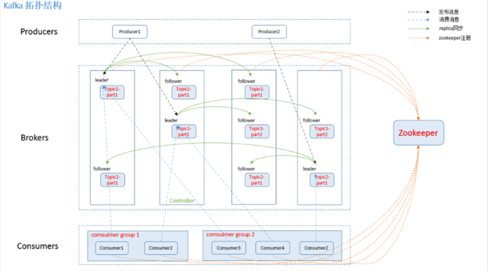

## **说说线程池**
<pre>
线程池主要工作是控制线程运行的数量,任务处理过程中创建并启动对应任务,当任务数量超出队列限制数目时,任务将进行排队等候,当其他线程运行
完毕后等待的任务再会从队列中出来执行.线程池的特点:线程复用,控制线程并发,管理线程.
  Java中通过Executor框架实现线程池，Executor、Executors、ExecutorService、ThreadPoolExecutor这几个类、接口都属于Java
  JUC包下的。创建线程池的几个重要参数，
    1.corePoolSize:线程池中核心线程大小(没有任务时线程的数量)，创建线程池后默认是没有线程的，当有任务后线程池才会创建线程，当前一个任务
    还未执行完，又新加任务时就会增加线程数目，线程数目的上限就是corePoolSize，超过上限后任务就会被暂存在队列中等待。即corePoolSize是队
    列不满时线程池中最大并行运行线程的上限。
    2.maximumPoolSize:线程池允许最大线程数，表示最大能创建多少个线程，线程池中当前线程数目不能超过该数量，若队列已满，且当前线程
    个数小于maximumPoolSize，线程池会创建新的线程来执行任务，这里值得一提的是largestPoolSize，该变量记录线程池整个生命周期中
    出现的最大线程个数。
    3.PoolSize:线程池中当前线程数量。
  通过讲述一下三者的联系来理解一下彼此的关系：当一个任务新加入线程池时，  
        1.此时corePoolSize>PoolSize: 代表此时运行的线程未达到核心线程数目，创建线程并执行该任务
        2.此时corePoolSize=PoolSize: 代表此时运行线程等于核心线程，再加一个任务就超了，会加入到等待队列中直到等待队列满了
        3.此时corePoolsize=PoolSize，且等待队列满了: 若PoolSize &lt; maximumPoolSize 则会创建新线程处理任务
        4.此时maximumPoolSize=PoolSize: 代表队列满了，且线程运行个数到达了最大值，再新加任务的话会执行拒绝策略
      PS：从上述描述可以知道三者大小关系，corePoolSize&lt;=maximumPoolSize;poolSize&lt;=maximumPoolSize;poolSize与corePoolSize
      大小关系不能一概比较。  
  
      线程池的拒绝策略：拒绝策略均需实现RejectedExecutionHandler接口方法rejectedExecution
        1.AbortPolicy，空方法，代表丢弃任务，但是会抛出RejectedExecutionException异常
        2.CallerRunsPolicy，调用入参r.run();也就是当添加到线程池中失败时由主线程来运行
        3.DiscardPolicy，空方法，丢弃任务，不会抛异常
        4.DiscardOldestPolicy，从线程池中的等待队列中取出队首元素，丢弃
        5.自定义策略，实现接口RejectedExecutionHandler的方法void rejectedExecution(Runnable r, ThreadPoolExecutor executor);
    4.keepAliveTime：空闲存活时间，线程池中的线程在多久内没有干活后停止，默认情况下这里被shutdown的线程是非corePollSize的线程，      
    5.Unit：时间单位，空闲时间的单位
    6.WorkQueue：等待队列，用于存储那些等待线程资源运行的任务，当前运行任务大于corePollSize，且队列没满的情况下，新加任务会进入队列中
    7.ThreadFactory：线程工厂，用于创建线程。
    8.Handler：线程池的拒绝策略
    
      线程池的队列：workQueue类型为BlockingQueue&lt;Runnable&gt;看名字就知道是阻塞队列了，通常可取以下三类：
        1.有界任务队列ArrayBlockingQueue，基于数组先进先出，数组嘛，创建时就要给定长度了当然是有界的了。
        2.无界任务队列LinkedBlockingQueue，基于链表先进先出，若创建时未指定链表大小，默认大小是Integer.MAX_VALUE长度的
        3.直接提交队列synchronousQueue，该队列不会保存任务，而是创建线程执行新来的任务。
          --TODO- 这个synchronousQueue有时间得搞明白来
               
  关闭线程池：ThreadPoolExecutor提供两个关闭方法，shutdown();shutdownNow();其中，shutdown方法不会立刻关闭线程池，它会等到
  缓存队列中所有任务执行完后再关闭线程池，且shutdown后便不再接受新的任务；shutdownNow会立刻终止线程池，并尝试打断正在执行的任务，
  清空等待队列返回尚未执行完的任务。shutdown方法是void的，shutdownNow方法返回值是List &lt;Runnable&gt;的        
  
  常用的线程池：
    1.newSingleThreadExecutor:创建单线程线程池，能保证加入线程池的任务顺序执行（因为该线程池提供的构造函数中无队列参数，内部实现
    给的阻塞队列是LinkedBlockingQueue）
    2.newFixedThreadPool:创建可重用固定大小的线程池，即便线程处于空闲，线程也不会被回收，除非线程池被关闭，当任务达到线程池初始化
    线程大小后，新加的任务便会进入等待队列，该队列是LinkedBlockingQueue的且是默认长度的（Integer.MAX_VALUE）
    3.newCachedThreadPool:可缓存线程池，线程数量不定，且最大线程是Integer.MAX_VALUE;如果线程池长度超过处理需要，可灵活回收线程，
    若无可回收线程，则创建新线程。线程池中的空闲线程有keepAliveTime，60s，此类线程池适合大量耗时小的任务。
    4.newScheduledThreadPool:创建定长线程池，支持定时、周期性的执行。适用于定时任务        
    
  一个任务从被提交到被执行，线程池做了哪些工作?
  
</pre>

## **关于锁**
<pre>
Java并发体系中的锁。七类：
1.偏向锁、轻量锁、重量锁
2.可重入锁、非可重入锁
3.共享锁、独占锁
4.公平锁、非公平锁
5.悲观锁、乐观锁
6.自旋锁、非自旋锁
7.可中断锁、不可中断锁
    1
    偏向锁：当锁不存在竞争时，该锁就没u存在的必要，只需打上个标记，这个步骤由jvm来执行。一个对象初始后还没有任何线程来获取它的锁的时候
  这个锁就可能是偏向的，当有第一个线程来获取的时候，它就将对应线程记录下来，以后如果来获取锁的是该记录线程就可以直接获取对应锁，开销更小。
    轻量锁：JVM开发者很多情况下，synchronized中代码是被多个线程交替执行的，而不是同时执行的，也就是说不存在竞争关系，或者竞争时间短，用
  CAS操作就能解决，没必要用synchronized重量锁，轻量锁是指当锁原来是偏向锁的时候，被另外线程访问了，说明存在竞争，那么偏向锁就会升级为
  轻量锁，线程通过自选操作等待获取锁资源，而非阻塞
    重量锁：互斥锁，利用操作系统的同步机制实现，开销较大，当多个线程存在实际竞争关系且竞争时间长时，轻量级锁满足不了要求，锁会膨胀为重量锁
  让其他申请但拿不到锁的线程阻塞。
    锁升级：无锁--偏向锁--轻量锁--重量锁
    2
    可重入锁：ReentrantLock，当前线程若已持有当前请求资源的锁时，能在不释放锁的情况下直接获取对应资源的锁；相反不可重入锁是即便当前对
    像以有请求资源的锁时也需要先释放对应锁才能再获取锁。
    3
    共享锁：一把锁可以被多个线程同时获得，独占锁：同一时刻只能有一个线程获得锁；按读写锁的方式来理解
    4
    公平锁：在等待锁资源的的情况下，公平锁会根据等待队列的顺序决定应该给哪个线程锁，非公平锁：先等待的线程不一定能优先获取锁
    5
    悲观锁：悲观锁认为数据一定存在竞争，所以要在获取资源之前拿到锁，进行独占；乐观锁不同，乐观锁认为数据不一定被改变，只有在改写数据的
    时候才会尝试锁住资源。乐观锁通过CAS的操作对数据进行更新修改。
    6
    不可中断锁：一旦申请获得锁成功，其他资源便只能等待拥有锁的线程释放锁，不能进行中断去做其他事情，也就是被阻塞；而可中断锁不同，在等待
    锁资源的时候，它允许停止获取锁进行中断获取锁的操作，转而进行其他操作。
   
</pre>

## **ReentrantLock使用场景**
<pre>
1.耗时操作重复点击提交。根据ReentrantLock.tryLock()状态决定是否继续操作。
2.阻塞执行，类似于synchronized，防止资源冲突，保证同一时刻只有一个线程可操作资源，适用于资源的竞争（读写文件、消息发送），可通过
lock.lock();阻塞程序运行
3.当锁被其他线程拿着的时候等待一段时间，等不到则不再获取锁，通过lock.tryLock(long,timeUnit);实现
4.运行一段程序，当发现该操作正在进行中则等待执行，期间可中断正在进行的操作立刻释放锁继续下一操作。这也是ReentrantLock与synchronized不
同的一个地方，是否可中断。lock.lockInterruptibly();

</pre>

````java
//耗时操作重复点击
//共享资源：
 class RR implements Runnable{
   private ReentrantLock lock=new ReentrantLock();
   public void run (){
     if(lock.tryLock()){
       //当前线程拿到了锁
       sout(Thread.current.getName());
       lock.unLock();
     }
   }
 }
// 资源请求类：
 class Test{
  psvm(){
    RR r=new RR();
    Thread t1=new Thread(r);
    Thread t2=new Thread(r);
    Thread t3=new Thread(r);
    t1.start();
    t2.start();
    t3.start();
  }
 }
 //输出结果：只要电脑CPU多核且运行速度足够，就只会打印一条，可在主线程start前进行sleep或者在RR类中tryLock加上超时时间

````

## **死锁条件**
<pre>
1.互斥；2.占有和保持；3.不可剥夺；4.循环等待
</pre>

## **AQS**  TODO 没整明白
<pre>
AQS：AbstractQueuedSynchronizer，抽象队列同步器，实现了对同步状态的管理，及对阻塞线程进行排队，等待通知等。AQS的核心包括：同步队
列、独占锁的获取与释放，共享锁的获取与释放，可中断锁，超时锁等。AQS是个抽象类，只作为一个模板（但很多性质顶层已经实现好了），当我们继承AQS去实现
自己的同步器时，要做的是根据自己同步器需要满足的性质来实现线程获取和释放资源的方式（修改同步状态变量的方式），至于具体线程等待队列的维护（如
资源获取失败入队，唤醒出队，线程在队列中的行为管理等）AQS已经实现了，这是AQS作为模板方法的实现。
AQS支持两种模式：独占与共享模式。独占：同一时刻只允许一个线程访问共享资源，如ReentrantLock，synchronized；独占又分公平/非公平；共享模式：
同一时刻允许多个线程访问共享资源。
AQS维护两个队列，一个是AQS类维护的CLH队列，一个是内部类ConditionObject维护的Condition队列（用于支持线程之间的同步，提供await、signal、signalAll方法）
AQS使用CLH内部队列，又成CLH锁（人名开头），该锁是基于链表的可扩展、高性能、公平的自旋锁，申请线程只能在本地变量上自旋，通过轮询前驱的状态，若
前驱释放了锁，则结束当前线程的自旋状态。
           +------+  prev +-----+       +-----+
      head |      | <---- |     | <---- |     |  tail
           +------+       +-----+       +-----+
 
</pre>

## **AtomicInteger的实现**
<pre>
AtomicInteger是对int的一个封装，提供原子性的访问和更新，多线程环境执行原子类的方法时，具有排他性，即某一时间段内，方法内的程序只会被其中一个线程
执行，其它线程进入自旋，自旋通常是执行一段无意义的代码，原子性的操作是基于CAS（Compare and Set），AtomicXXX类都依赖于UnSafe类提供的一些操作
以volatile的value字段记录数值，保证可见性，UnSafe类利用value字段的内存地址偏移完成操作，CAS操作涉及CAS指令，这部份实际涉及操作系统指令，大多数
操作系统上CAS指令是个非常轻量级的操作。
</pre>

## **乐观锁与悲观锁**
<pre>
CPU是时分复用的，CPU的时间片会被分配给不同的线程/进程轮流执行，时间片与时间片之间需要CPU进行调度切换，即发生进程的切换，切换涉及清空寄存器、缓存
数据，然后重新加载新的Thread所需数据，当一个线程被挂起时，进入阻塞队列，在一定时间或条件下，被其它线程通过notify();notifyAll();唤醒。当某个线程
存在某些资源不可获取或者资源不可用的情况下就会让出CPU，将当前线程状态改为阻塞状态，等到资源可用了，再将线程唤醒进入runnable状态，等待CPU调度，
这就是典型的悲观锁的实现，独占锁便是一种悲观锁，synchronized时典型的独占锁，它假设最坏的情况，确保运行线程不被其他线程干扰，会导致其它线程挂起，
等待持有锁的线程释放锁。
  但是进程从挂起到恢复执行过程中增加了额外的开销，线程等待时无法进行其它操作，考虑这样一个场景，在取得锁资源后执行不复杂不耗时的操作，线程A，B
  竞争锁资源，先是A拿到资源，上锁，紧接着B请求资源，发现拿不到锁，进入阻塞挂起，同时A释放了锁，B发现了，需要从阻塞状态恢复，然后抢占锁，这样就
  增大时间开销了。
那么如果我们不加锁，而是假设没有冲突，而去完成某项操作，如果发现冲突，那么久让本次操作失败，然后重试，这样线程就不用让出CPU，通过while循环执行，
直到成功，这样在竞争不激烈的情况下减少了因为切换线程状态的开销，这就是乐观锁。CAS就是乐观锁的一种实现。  
  CAS：Compare And Set，比较并设置，很多CPU直接支持CAS指令，多个线程尝试使用CAS同时更新共享资源时，只有一个线程能够成功，其它的失败，失败的线程
  不会被挂起，而是被告知本次更新失败，且可以重试，CAS有三个操作数：内存值A，期望值B，更新值C。仅当期望值B与内存值A相等时，才会为内存值更新为C，
  否则什么也不做，但这样同样存在ABA问题，即 内存值被更新过两次，开始是B，后被其它线程更为C，再被其它线程更为B，这样根据CAS的三个操作数来看的话，
  表面上是符合更新条件的，但实际上内存值已经被修改过了，可以增加实际戳/版本号一起比较，每次更新都会修改增加版本号或时间戳。
  
</pre>

## **volatile关键字**
<pre>
被volatile修饰的变量具有特性：1.保证变量对其他线程的可见性；2.禁止对与volatile修饰的变量进行有关指令重排
1.可见性：volatile能够保证当一个线程修改了变量的值后立刻将修改后的值写入主存。volatile变量的访问规则：使用前必须从主内存刷新最新值；修改后要
立刻同步主内存。
2.禁止指令重排优化：虚拟机会为了减少因为内存操作导致的CPU时间片闲置进行指令重排，这个重排是指单线程环境在不影响最终结果的前提下对运算指令进行
重排。
由于volatile只能保证可见性 不能保证原子性，仅基于volatile的变量运算是线程不安全的，它能保证线程在读取该变量的那一刻数据是正确的，但各线程从中
读取后执行其它操作（更新，或者准备写进主存）但尚未写回到主存中，其它线程对变量进行了修改，这种情况便存在问题了。
  volatile使用的场景：运算结果不依赖变量当前值（也就是不会用该值参与运算），或者能保证只有单一的线程修改变量的值。这样理解：多个变量之间或某
  个变量修改前后没有约束。要使volatileb变量提供线程安全需满足下面条件：1.对变量写操作不依赖当前值；2.该变量未包含在具有其它变量的不变式中。
  白话就是在对变量修改的时候不会先判断一下 xx=多少或者xx！=多少然后再对xx进行赋值修改；volatile不适用于【读取-修改-写入】的场景
 volatile一个很适合的场景：
  private volatile ifShutDown=false;
  void shutDownNow(){ifShutDown=true;}
  void doWork(){
    while(!ifShutDown){
      //do work;
    }
  }
  
</pre>

## **ThreadLocal**
<pre>
ThreadLocal太重要了，以至于我忘了，这里再整一遍加深一下印象，从ThreadLocal、Thread、ThreadLocalMap三个class的结构开始。ThreadLocal：是我们
new创建的对象，一个类中我们能创建多个ThreadLocal对象，ThreadLocalMap是ThreadLocal的内部类，ThreadLocalMap类似于Map，使用Entry[]数组存储数
据，Entry对象继承虚引用的ThreadLocal，然后Entry对象有个Object属性作为map的value，容易看出，key的类型是WeakReference&lt;ThreadLocal&gt;,
value的类型是Object，ThreadLocalMap存储在Thread中，即Thread有个ThreadLocalMap类型的属性，这样就能理解三者的关系了。在一个类中创建多个不同的
ThreadLocal对象，通过ThreadLocal的set(Object)方法向ThreadLocal写入value，ThreadLoca会获取当前线程的ThreadLocalMap，然后将ThreadLocal对象
作为key新的value作为值，存入对应Thread的ThreadLocalMap中。
  再从内存存储结构来理解一下三者的关系，对象创建存储在堆内存属于线程共享，线程运行有其独立空间--栈，栈中持有堆中对象的引用但不持有对象本身，
  得出Thread的reference指向堆中Thread，堆中Thread持有ThreadLocalMap对象，ThreadLocalMap又持有Entry&lt;WeakReference&gt;数组数组中
  存储key-value，其中key又是ThreadLocal对象，这样就能解释为什么Entry中key是WeakReference的了。
  
 ThreadLocal在内存哪一块?如果是指对象，那当然是在堆内存，如果是指引用那当然是在栈内存。ThreadLocal被线程中ThreadLocalMap属性的Entry属性的
 WeakReference&lt;ThreadLocal&gt;
</pre>

## **Java NIO Buffer**
<pre>
Buffer：缓冲区，NIO中数据通常是从channel进入Buffer或者从Buffer进入channel的，缓冲区的本质是一块可读写入数据的内存区，被Java NIO包装成Buffer类
使用Buffer一般遵循如下步骤：
  1.写入数据到Buffer
  2.调用Buffer.flip();方法调整position
  3.从buffer中读取数据
  4.调用clear或者compact方法
向Buffer写数据时，Buffer会记录写了多少数据，一旦要读取数据，需要通过flip方法将Buffer从写模式转换到读模式。读模式下可以读取到之前写入到Buffer的
所有数据，一旦读完了所有数据，就需要清空缓冲区，让其能够z再次被写入，清缓冲区可通过Buffer.compact()/Buffer.clear()。clear会清空整个缓冲，compact
会清空已经读过的数据，任何未读过的数据都会被移到缓冲区的起始处，新写入的数据将被放到缓冲区未读数据的后面。
  Buffer的三个重要属性：capacity、position、limit
  position和limit的含义取决于Buffer处在何种模式下，读模式或者写模式。
    1.capacity: 指Buffer的内存大小，它限制了允许写入多少了类型值(byte\long\char)
    一旦Buffer满了，就需要清空(通过compact、clear)才能继续往里写数据
    2.position: 当写数据到Buffer中时，position标识当前位置，初始的position为0，当byte、long、char等数据写入Buffer后，position会移动到下一个
    写数据的Buffer单元。按此推算position最大值为capacity-1
    3.limit: 写模式下，limit表示最多能向里写多少数据，写模式下limit=capacity，当切换模式到读模式时，limit表示能读多少数据，因此当切换Buffer
    到读模式后，limit会被设置为写模式下的position位置，表明读取到哪里，也就是说，你能读到之前写入的所有数据(limit设置为position也就是当前写入Buffer
    的数据量)
要想获得一个Buffer对象首先需要进行分配Buffer.allocate(int);存储大小与Buffer类型相关。
向Buffer写数据有两种方式，一种是从Channel到Buffer、一种是使用Buffer的put方法。
  1.Channel写到Buffer：int read = Channel.read(Buffer);    
  2.Buffer.put()：Buffer.put();//put方法有很多重载方法，有的允许写到指定位置，有的允许写入一个类型数组
  
  flip()方法：flip方法会将Buffer从写模式切换到读模式，将position设回为0，并将limit设置为之前的position。即从0开始读，limit为之前写到的position
 
从Buffer中读取数据： 一种是从Buffer中读取数据到channel，一种是通过Buffer.get();获取数据
  1.int length=Channel.write(Buffer);//往Channel中写Buffer的数据
  2.Buffer.get();
  
  rewind()方法： 将position设回为0，允许重新读取Buffer的数据，limit仍标识能读多少数据。
  
  clear()与compact()方法都可用于清理Buffer缓冲区。clear方法 limit被设置为capacity，position设置为0，这样Buffer的数据会被后面重新写入的数据覆盖；
  compact方法 将所有未读数据拷贝到Buffer的起始处，然后将position设到最后一个未读元素的正后面，limit设置为capacity。这样向Buffer写数据也不回覆盖
  之前已有的数据。
  
  mark()与reset(): mark方法可以标记Buffer的某个position，通过reset方法可以恢复position到mask方法标记位。
  
  equals()与compareTo()，两方法都是用于比较两Buffer的，但是很明显Buffer重写过equals方法，compareTo()方法：以ButeBuffer为例，大体上是依次取Buffer
  中byte进行对比返回值为 int。
</pre>
  
## **NIO Scatter/Gather，Channel直接的数据传输**  
<pre>
  Scatter/Gather用于描述从channel中读取或者写入数据到Buffer的操作，Scatter 字义分散，因此Channel将从Channel读取数据到多个Buffer中，Gather
  字义 聚集，指将Buffer数据写入channel中是 多个Buffer写入一个Channel的，channel将多个Buffer的数据gather后发送到channel。Gather于Scatter常用于
  需要将数据分开传输的场景，如传输一个消息头和消息体组成的消息，我们可能将消息头和消息体分散到不同的Buffer中，方便处理。
  
  Scattering Reads 一个channel向多个Buffer分散数据，只有当前Buffer填满了，才会向下一个Buffer填数据。实现就是Channel.read(ByteBuffer[]);ByteBuffer重载了多个read方法实现，其中一个重载就是入参
  ByteBuffer数组。read方法按照buffer在数组中顺序将channel中读取的数据写入Buffer，当一个Buffer写满后，channel会向另外y一个Buffer写。
  Scattering Read方法在移动下一个Buffer前必须要写满当前Buffer，这意味着他不适用于动态的消息接收（消息大小不固定），换句话而言 如果存在消息头消息体
  消息头必须填满，ScatteringReads才能正常working。
  Gathering Writes 是指数据从多个Buffer写入到一个Channel，方法是Channel.write(ByteBuffer[]);同样Channel也重载了几个write方法，用于不同场景下的
  Buffer数据写入Channel。Buffer数组作为write方法的入参，write方法会按照Buffer在数组中顺序，将数据写入channel，只有positionh和limit之间的数据才
  会被写入，所以，如果一个Buffer的容量是128，但只有58的数据，那么该58的数据会被写入到Channel中，可见 Gathering Write可用于从Buffer中动态获取数据。

 channel的数据传输
 
 Java NIO中，如果两个通道有一个是FileChannel，那可以直接将数据从一个channel传输到另一个channel，transform();FileChannel.transform()方法可以将数据
 从源通道传输到FileChannel。
 eg：
 RandomAccessFile rfaFrom=new RandomAccessFile("from.text","rw");
 RandomAccessFile rfaTo=new RandomAccessFile("to.text","rw");
 FileChannel fromChannel=rfaFrom.getChannel();
 FileChannel toChannel=rfaTo.getChannel();
 long position=0;
 long count = long fromChannel.size();
 toChannel.transferForm(position,count,fromChannel);
 transferForm方法入参 position 表示从position处开始向目标文件写数据，count表示最多传多大大数据，如源通道fromChannel没有count这么多数据，实际传
 输的数据会小于count。
 ps：需注意的是，SocketChannel的实现中，SocketChannel只会传输此刻准备好的数据（当然有可能小于transferForm方法的参数count），可能不会将SocketChannel
 中所有的数据全部传输到FileChannel中。
 
 通过transferTo()方法能将数据传输从FileChannel中传输到其它Channel，用法大致与transferFrom相同，只是意义不同
  
  Selector:通过Selector st=Selector.open();//创建一个selector
  向Selector注册Channel:  SelectionKey sk = channel.register(selector,SelectionKey.OP_ACCEPT);
  与Selector一起使用的Channel 需要是非阻塞的即需要 使用Channel.configureBlocking(false);而FileChannel是不能设置ConfigureBlocking属性的，
  套接字通道可以，当使用的通道需要对多个事件关注时，可以使用 位或符将SelectionKey的常量连接 如SelectionKey.OP_ACCEPT | SelectionKey.OP_READ .
  一个Selector可以被注册多个Channel注册，通过Selector.selectionKeys();可以拿到Selector上的通道集合Set&lt;SelectionKey&gt;,前面说到了Channel
  可以对多个事件进行关注，通过int val = SelectionKey.interestOps();可以拿到Channel.register时关注的值，（val & Selection.OP_ACCEPT)==Selection.OP_ACCEPT
  可判断通道注册时是否对该事件进行了关注。Channel的register方法第三个参数是给Object类型，作为附件，与该channel关联。
  某线程调用select()方法阻塞后，其它线程在对应Selector上调用Selector.wakeup()方法可令阻塞在select()方法上的线程wakeup
  
  Selector.close(): 调用close方法会关闭该Selector，注册到该Selector的SelectionKey都会无效化，但并不关闭Channel本身.
  
  FileChannel.position()方法，有时需要在FileChannel的某个特定位置对数据进行读写操作，可通过position()方法获取当前FileChannel的position，
  可通过FileChannel.position(long);设置FileChannel的position。
  
  SocketChannel: 打开SocketChannel 
  SocketChanne sc = SocketChanne.open();
  sc.connect(new InetAddress("https://localhost/mytwo",8838));
  关闭SocketChannel  sc.close();
  从SocketChannel读数据：需调用read方法 SocketChannel.read(Buffer); SocketChannel读数据到Buffer中，read方法返回int，代表读了多少数据到Buffer
  中，当返回-1时代表SocketChannel的数据读光了。
  写入SocketChannel，SocketChannel.write(Buffer);
  
  SocketChannel接收数据：打开UDP连接：DatagramChannel dgc = DatagramChannel.open(); dgc.socket().bind(new InetAddress(8083));
  ByteBuffer bf=ByteBuffer.allocate(1024); bf.clear();fgc.receive(bf); receive();方法将接收到的数据包内容复制到指定Buffer，如Buffer数组
  存不下，数据将被丢弃。
  
  SocketChannel发送数据：DatagramChannel dgc=DatagramChannel.open();Byte bf=ByteBuffer.allocate(1024);bf.put("tt".getBytes());
   buf.flip(); dgc.send(bf,new InetSocketAddress("127.0.0.1",8083));
    
  </pre>
  
## **Java BIO NIO**
<pre>
NIO: 又称Non-Blocking IO、new IO，属于一种同步非阻塞IO模型，也是IO多路复用的基础，解决并发与IO处理问题。
先说说传统IO，与NIO相比BIO(Blocking-IO)，阻塞IO的经典代码：
======服务器端start=======
{
ExecutorService executor=Executors.newFixedExecutorService(100);
ServerSocket serverSocket=new ServerSocket();
serverSocket.bind(new InetSocketAddress("localhost",8088));
while(!Thread.currentThread.isInterrupted()){
  //主线程循环等待连接的到来
  Socket socket = serverSocket.accept();
  executor.sumbmit(new ConnectHandler(socket));
}
//线程处理连接
class ConnectHandler extends Thread{
  private Socket socket;
  private byte[]bytes;
  public ConnectHandler(Socket socket){
    this.socket=socket;
  }
  public void run(){
    while(!Thread.currentThread.isInterrupted()&&!socket.isClose()){
      socket.getInputStream().read(bytes);//接收客户端的input内容
      socket.close();
    }
    sout(new String(bytes));
  }
}
}
======服务器端end=======

======客户端start======
{
Socket socket=new Socket();
SocketAddress socketAddress=InetSocketAddress("localhost",8088);
socket.connect(socketAddress);
OutputStream outputStream = socket.getOutputStream();
outputStream.write("hello".getBytes(StandardCharsets.UTF-8));
}
======客户端end======
上述连接是每个连接对应一个线程的模型，使用线程的原因是因为socket.accept(),socket.getInputStream.read,socket.getOutputStream.wirte()是同步阻
塞的当一个连接在处理I/O时系统是阻塞的，若系统是单线程的话必然挂起等待阻塞，但是CPU是被释放出来的，使用多线程就能让CPU的使用效率更高，这也是多线程的
本质:利用多核；当I/O阻塞系统，但CPU空闲时可以利用多线程充分利用CPU资源。 现在 多线程一般都使用线程池，可以让线程创建及回收成本降低，在活动连接数不
是很高的情况下（小于单机一千），可以让每个连接专注于自己的I/O且编程简单，也不用过多考虑系统过载、限流等问题，线程池本身就是一个天然漏斗，能缓冲一些
系统处理不了的连接或者请求。不过这类模型很依赖线程，而大多数情况下，线程又是较宝贵的资源：
  1.线程的创建销毁成本较高，linux操作系统中，线程本质就是一个进程，创建和销毁都属于重量级系统函数 
  2.线程本身占用较大内存，像Java线程栈，一般至少分配512k-1M的内存空间，当线程开辟过千，那累加起来消耗的内存也是相当可观的，会占据大半JVM内存
  3.线程之间的切换成本也是较大的，操作系统线程切换时，需要保留线程的上下文，然后执行系统调用，如果线程数目太多，可能执行线程切换的时间甚至大于线程
  实际执行时间，这时候带来的表现往往是系统load偏高，CPU 使用率特高（20%以上）导致系统几乎可用
  4.容易造成锯齿状系统负载，因为系统负载是用核心CPU数或者活动线程数。一旦线程数量高但外部环境不稳定时就很容易造成大量线程同时返回，然后阻塞，导致
  系统负载压力过大从而系统不可用。
  
 所有系统IO都分两个阶段：等待就绪和操作。例：读函数分等待系统可读以及读 两个阶段；写函数分等待资源可写以及真正的写。其中等待就绪这个过程是不占用CPU
 的，是在"空等";而真正的读写操作的阻塞是使用CPU的，且这个过程是很快的，属于memory copy，是基于内存操作的，可理解为基本不耗时。
 
 以socket.read()为例：传统BIO socket.read();当TCP RecvBuffer中没有数据时函数会阻塞，知道接收到数据，然后返回数据。对于NIO而言，如果TCP RecvBuffer
 有数据，就从网卡中读取数据到内存，并返回给用户，反之直接返回0，不会阻塞。最新AIO(Async I/O)中会进一步，不光等待数据是异步的，连数据从网卡到内存也是
 异步的。这样理解：BIO关注的是要读要写，不能读或写就呆等；NIO关注的是能读了、能写了，不能的这段时间里允许进行其它的工作；AIO关注的是读完了。
 NIO的一个重要特点是:socket的主要读、写、注册、接收函数在等待就绪阶段都是非阻塞的，实际上IO操作是同步阻塞的(这个步骤会消耗CPU但是会很快)。
 
 结合事件模型使用NIO同步非阻塞模型：之前BIO使用线程池进行操作了，BIO我们无法知道什么时候能写、能读只有两个阻塞函数：socket.read();socket.write();
 这两个函数无法进行有效的中断，所以我们通过线程池来提高CPU利用率。
 NIO的读写函数会立刻返回，有鉴于此我们可以考虑这样：若一个连接不能读、写（socket.read();socket.wirte();返回0)，我们可以将这件事记录，记录的方式
 通常是在selector上注册标记位，然后切换到其它就绪的连接(channel)继续读写。
 利用事件模型单线程处理所有IO请求：NIO主要有几个事件：都就绪、写就绪、有新连接到来。我们需要先注册对某件事情感兴趣的处理器，在合适的时机告诉处理器，
 对这件事情标识关注。如对于写操作，就是对写不出去的时候感兴趣；对于读操作，就是完成连接和系统无法承载新读入数据的时候；对于server端accept，一般是服
 务端刚启动；对于connect，一般是connect失败需要重连或直接异步调用connect的时候。
 ps：select是阻塞的，无论是通过操作系统的通知（epoll）还是轮询（select、poll），这个函数是阻塞的，所以可以安全的在一个while loop里调用该函数，而
 不必关心CPU空转。
 
 NIO由原来阻塞读写(占用线程)变成单线程轮询事件，找到可以读写的网络描述符进行读写，除了事件轮询是阻塞的，剩余的IO都是纯CPU操作，故而不需开新线程。且
 减少了线程的数量，减少了切换线程的开销。单线程因为不需切换线程处理IO的效率高，只负责读、写、选择事件，但是现在的服务器一般都是多核的，如果能利用多
 核进行IO，来分析一下我们需要的线程，其中主要包括 1.事件分发器，单线程选择就绪的事件。2.IO处理器，包括connect、read、write等此类纯CPU操作。3.业务
 线程，在处理完IO后，业务一般还会有自己的逻辑，有的还有其它阻塞IO，如DB操作、RPC操作，只要有阻塞就需要单独的线程。
   Java的Selector对于Linux来说有个限制，同y一个channel的select不能被并发调用，因此如果有多个IO线程，必须保证，一个socket只能属于一个IOThread
   一个IOThread能够使用多个Socket。
   
  另外连接的处理与读写的处理通常不放在一起，可以选择分开，这样对于大量连接的注册、读写就可以分发。NIO的read、write虽然是非阻塞的函数，但毕竟占用
  CPU。 
   
 
</pre>

<h6>传统IO模型</h6>


<h6>优化线程模型</h6>


## **Java NIO**
<pre>
NIO的三大核心部分：Channel、Buffer、Selector。传统IO面向字节流字符流操作NIO面向缓冲区，NIO基于Channel、Buffer，数据从channel读到buffer，或者从
buffer写到channel中；Selector用于监听多个通道的事件(连接的打开，数据的到达)，即Selector可监听多个channel。这样理解，一个线程可以处理多个NIO（包
括读、写）当某通道发起读请求时，线程尝试读，若状态不是读就绪的话，该线程也不会阻塞，它可以尝试进行其它通道的读或写，写则相同。
  Channel：channel应当与Stream是同级的，但Stream是单向的，Channel是双向的，channel既可以读又可以写。NIO的主要实现有FileChannel(文件)、
  DatagramChannel(通过UDP从网络中读取数据)、  SocketChannel(通过TCP从网络中读取数据)、ServerSocketChannel(可通过监听新进的TCP连接)。
  Buffer：这个很好理解、缓冲区ByteBuffer、CharBuffer ..... 各种类型的buffer，用对应类型的数组存数据
  Selector：Selector运行单线程处理多个channel，若channel处理流量较小时，使用单个Selector处理多个channel是个很好的选择，要使用Selector得向Selector
  注册channel，然后调用Selector.select()方法，该方法会一直阻塞到某个注册的channel有事件是就绪态了，然后线程就可以处理就绪的channel事件。
=========================NIO读文件===========================
File file=new File("B:\\test.text");  
FileOutputStream fos=new FileOutputStream(file);
FileChannel fosChannel=fos.getChannel();
ByteBuffer byteBuffer=ByteBuffer.allocate(1024);
int read=0;
while(read!=-1){
  read=fosChannel.read(byteBuffer); //将数据读取到缓冲中
  byteBuffer.flip();//数据进入缓冲后 移动反转buffer的position
  while(byteBuffer.hasRemaining()){
    sout((char)byteBuffer.get());
  }
  byteBuffer.compact();
}
//上述代码会将file文件的内容以单个字符形式打出
=========================NIO读文件===========================

=========================NIO写文件===========================
File file=new File("B:\\test.text");
FileOutputStream fos=new FileOutputStream(file);
FileChannel fileChannel=fos.getChannel();
ByteBuffer byffer=ByteBuffer.allocate(1024);
byffer.put("hello".getBytes());
byffer.flip();
while(buf.hasRemaining()){ //这里用loop向channel写数据 因为不能保证每次write写了多少数据 所以需要重复调用 直到Buffer中没有未写入channel的数据
  fileChannel.write(byffer);
}
fileChannel.close(); //FileChannle用完后一定要关掉
fos.close();

=========================NIO写文件===========================

</pre>

## **NIO TCP应用**
<pre>
SocketChannel：套接字管道，NIO的channel可通过配置其阻塞行为以实现非阻塞信道：channel.configureBlocking(false);在非阻塞通道上调用一个方法时，
总是会立刻返回，这类调用的返回值指示了请求调用的操作的完成程度，例如在一个非阻塞ServerSocketChannel上调用accept方法，如果有连接接入，则返回客户端
SocketChannel，否则返回null，而非阻塞式等待返回。
/** client端 **/
ByteBuffer bff=ByteBuffer.allocate(1024);
SocketChannel socketChannel = SocketChannel.open();
socketChannel.configureBlocking(false);
socketChannel.connect(new InetSocketAddress("localhost",8080));
if(socketChannel.finishConnect()){
  int i=0;
  while(true){
    TimeUnit.SECONDS.sleep(1);
    String info="info this is the "+ i+++" info from client ";
    bff.clear();
    bff.put(info.getBytes());
    bff.filp();
    while(bff.hasRemaining()){
      socketChannel.write(bff);
    }
  }
}
/** client端 **/

/** server端 **/
ByteBuffer bff=ByteBuffer.allocate(1024);
ServerSocket serverSocket=null;
InputStream ips=null;
serverSocket=new ServerSocket(8003);
int recvMsgSize=0;
byte[]recvByte=new byte[1024];
while(true){
  Socket socket=serverSocket.accept();
  SocketAddress socketAddress=socket.getRemoteSocketAddress();
  System.out.println(socketAddress.toString());
  ips=socket.getInputStream();
  while((recvMsgSize=ips.read(recvBytes)!=-1){
    byte[]temp=new byte[recvMsgSize];
    System.array.copy(recvBytes,0,temp,0,recvMsgSize);
    System.out.println(new String(temp));
  }
}
/** server端 **/
server端while循环accept等待客户端请求连接，accept通过后，socket获取输入流，client端connect连接服务端，当SocketChannel.finishConnect();便通过
channel.wirte(ByteBuffer);写数据。这里的server端并没有使用Selector而是使用了阻塞accept，读取和分发需要一个方法阻塞等待，直到至少一个信道可以进行
IO操作，并告知是哪一个信道.NIO的selector作用便是这个，多路开关选择器，一个选择器可管理多个信道上的IO操作，然而如果用传统方式处理多客户端的连接就需要
循环检查客户端是否有IO操作，如果有则将该客户端的连接交予线程池处理，如果没有则进行下一次轮询，当所有客户端都轮询过后，便开始下一次轮询，这种操作看起来
是呆呆的，因为大部分客户端连接是没有IO操作的，selector不同，selector在内部管理多个IO，当一个客户端有连接时，他会通知selector，selector便记住这个
信道上有IO操作，并告知是何种类型的IO操作（读、写、接收连接），其返回的结果只有两种 0或者是一组需要IO操作的客户端，这样，就减少了轮询那一步。

要使用selector需要创建一个selector实例（使用静态方法open）并将其注册到意图监控的信道上（Channel提供的register，而非Selector提供的）最后调用选择器
的select方法，该方法会阻塞等待，直到有一个或更多的信道准备好IO操作或等待超时，select方法将返回可用客户端连接信道数量，现在单线程中通过调用select方法
就能检查多信道是否准备好进行IO操作，如一段时间后select(TimeOut)返回0，那么允许程序进行其它操作。通过selector的selectedKeys可获取可用selectionKey
再通过selectionKey的isAcceptable、isReadable、isWriteable、isConnectable判断对应信道的状态，然后进行对应操作,当然channel使用register向channel
注册的时候便可指定关心的事件。

eg：
Selector selector=null;
ServerSocketChannel ssc=null;
try{
  selector=Selector.open();
  ssc=ServerSocketChannel.open();
  ssc.socket().bind(new InetAddress(8083));
  ssc.configureBlocking(false);
  SelectionKey acceptKey = ssc.register(selector,SelectionKey.OP_ACCEPT);
  //注意 acceptKey只关系accept事件，可通过下述代码做统一处理
  while(true){
    if(selector.select(timeOut)==0){
      //do something not have connection ready
    }
    Iterator&lt;SelectionKey&gt;set=selector.selectedKeys().iterator();
    while(set.hasNext()){
      SelectionKey key = set.next();
      if(key.isAcceptable()){//do something accept}
      if(key.isReadable()){//do something read}
      if(key.isWriteable()&&key.isValid()){//do something write}
      if(key.isConnectable()){// do some connect}
      iter.remove();
    }
  }
}catch (Exception e){
}finally{
  if(null!=selector){ selector.close(); }
  if(null!=ssc){ ssc.close(); }
}
从SelectionKey中可以获取到Channel、Selector，可以将更多信息附着到SelectionKey上，这样就更方便于识别通道，例如可以附加与通道一起使用的Buffer，或
是包含数据聚集的某个对象，selectionKey.attach(new Object());attach对象 也可作为参数放在register方法的第三个参数上。

Selector选择通道，向selector注册了通道后，便能通过select方法获取可用的通道，select()方法会阻塞到至少有一个通道是可用的select(timeout)方法会阻塞
至多timeout的时间，select方法返回是int类型的表明有多少通道是就绪的，或者说距离上次调用selec方法有多少通道是就绪的。我们可以这样处理，Selector的
select方法返回大于0时，通过selector.selectedKeys获取所有可用SelectionKey对象，通过selectionKey.isXXX判断状态，通过SelectionKey.channel拿到
对应通道，然后处理。ps 值得注意的一点是处理完一个selectionKey后还需要手动remove对应selectionKey
</pre>

## **内存映射文件**
<pre>
Java处理大文件，一般用带缓冲的IO类，BufferedReader/BufferedInputStream此类带缓冲的IO类，但是文件超大的话更快的是使用MappedByteBuffer，该类是
NIO引入的文件内存映射方案，具有较高读写性能，NIO最主要的是实现了对异步操作的支持，其中一种是通过一个将套接字管道SocketChannel注册到Selector中，
时不时调用selector的select方法，如有可用管道，则通过selector.selectedKeys获取selectionKey集合，此类集合就包含socket事件信息，这就是select模型。
SocketChannel的读写是通过ByteBuffer来操作的。
</pre>


## **netty**

## **JVM内存区域分布**
<pre>
内存独占区：栈、pc(程序计数器)
  栈包括方法栈、本地方法栈(native方法)：简单介绍一下栈，Java中方法运行实际上是方法代码栈帧在栈中出栈入栈的过程，普通栈又称虚拟机栈，存放函数定义
  的变量，包括引用变量和基本类型(byte,short,boolean,int,long,float,double,char),native栈与普通栈没有什么区别。ps：栈作为独占区域，是局部创建
  的，也就是当方法运行时才会创建栈帧，存放局部变量、引用、基本类型、常量池的引用、操作数栈
  
  pc：程序计数器用于指示当前代码运行到何处了。

内存共享区：堆、方法区
  堆：众所周知，所有new出来的对象，内存区域都在堆中，所有的对象都在堆中创建，栈中只存放堆中对象的引用。包括数组，数组也在堆中
  
  方法区：方法区又称非堆，常量池也在这里，存放常量、静态变量、静态常量、静态代码块、及jvm加载好的类信息(字节码、field、class、method)
  
GC：JVM的gc频繁发生在堆中，堆中存放所有对象。 堆分为年轻代、年老代，两区域使用的GC算法不一样，新创建的对象存放在年轻代中，年轻代又分eden区与survivor区，
  survivor区分from/to 两区域，Eden区中对象在minor gc发生时会根据是否存活被筛选进入from区，  在达到阈值之前，每发生一次minor GC新生代中存活的对象都会
  从from区移动到to区，然后反转from/to区，达到阈值后，会将达到阈值的存活的对象移动到年老代。
  
</pre>

## **实现自己的类加载器**
<pre>
类加载过程：加载、验证、准备、解析、初始化.
  加载：根据类全限定名找class文件二进制字节流，将对应字节流代表的静态存储结构转化为运行时存储结构，在内存中生成一个class对象
  验证：检查是否符合JVM规范
  准备：正式为class变量分配内存并设置初始化值，此处分配的内存仅限方法区中内存，为什么？因为此时类还未被new出来只是前期的准备工作，这里分配的是静态资源的内存
  解析: 解析阶段jvm将常量池内符号引用替换为直接引用
  初始化：执行类中定义的代码的过程

Java类加载器 从上到下: BootStrapClassLoader,ExtensionClassLoader,ApplicationClassLoader,UserClassLoader
  BootStrapClassLoader作为Java虚拟机一部分使用C++实现，程序启动初会被加载，负责Java标准库(lib/rt目录下)的加载，也只有该类加载器能完成此任务
  ExtensionClassLoader负责加载标准扩展库(加载目录可以指定默认是 lib/ext目录下，可使用Java.ext.dir指定扩展加载目录)
  ApplicationClassLoader负责加载系统类ClassPath路径指定的类库，又称SystemClassLoader，可通过getSystemClassLoader()方法获取
  UserClassLoader 这里取的一个名字而已，用于代表自定义类加载器。自定义的类加载器如果没有明确地指定父加载器时，默认父加载器是ApplicationClassLoader
  
  ps：类加载器的父子关系很重要，当子类加载试图加载时会优先委托父类加载器进行加载，只有当父类加载器无法加载时子类加载器才会开始。
  
  显示地使用类加载器最常见的是加载数据库驱动，Class<?>clazz = Class.forName("com.mysql.jdbc.Driver");
    这里需要说下Class.forName是干嘛的，他返回的是个Class，他会根据参数(类的全限定名)装载该类并实例化该类；装载该类用到的类加载器是当前类。
    与ClassLoader.loadClass()比较：Class.forName 同名方法有两个，其中一个可以指定ClassLoader，不指定的默认使用Class.forName("com.mysql.jdbc.Driver",true,
    this.getClass().getClassLoader()); 那个true代表 initalize 即装载的类是否被初始化过，如果没有初始化过，则会被初始化(回忆一下，加载、验证、准备、解析、初始化)
    ClassLoader.loadClass();方法需要指定是哪个ClassLoader，也就是指定类加载器实例。Class.forName("");装载的Class会被实例化返回，ClassLoader.load()
    只是将信息装载给JVM。 
    
    Class.forName("com.mysql.jdbc.Driver");如果换成getClass().getClassLoader().loadClass("com.mysql.jdbc.Driver");是不允许的，因为ClassLoader.loadClass
    只是想JVM装载Driver类的信息，并未实例化，无法执行相关的操作，Driver是需要被初始化才能使用的。
    
  实现目录型类加载器：
    思路：将指定目录将指定目录追加到类加载器类路径即可。
    public static ClassLoader createClassLoader(String dirName) throws Exception{
            URL[] urlArr=new URL[1];
            File file=null;
            //路径合法性判断
            if(dirName.endsWith("/")){
                file=new File(dirName);
            }else{
                //dirName不是/结尾的，加上
                dirName+="/";
            }
            urlArr[0]=file.toURI().toURL();
            ClassLoader systemClassLoader = ClassLoader.getSystemClassLoader();
            return new URLClassLoader(urlArr, systemClassLoader);
        }
        public static void useClassLoader() throws Exception {
            ClassLoader loader = createClassLoader("/tt/");
            Class<?> aClass = Class.forName("aa.main", true, loader);
        }
      
</pre>

## **理解Class.forName**
<pre>
  Class类概念：Class也是一个Java类，保存与之对应Java类meta元数据信息，用于描述该类结构，比如描述一个类有哪些成员、方法等，元数据信息在反射中使用较多。
    Java源程序(.java文件)在经过Java编译器编译后就被转换成Java字节码文件(.class文件)，类加载器负责读取Java字节码，并转换成java.lang.Class类的一个实例
    即Class对象，也就是说，在Java中，每个Java类都有一个相应的Class对象，用于表示此Java类的信息
    
  类加载的概念：当使用一个类(比如new一个类的实例)，会检查此类是否被加载到内存中，如果没有，则执行加载操作，读取类对应class文件数据，解析此数据，构造一个
  该类对应的Class类的实例，此时JVM就能使用该类了，如实例化此类，调用此类的静态方法、属性等。Java也提供了手动加载类的接口，Class.forName()便是其中之一
  用于获取对应类的Class
  
  类加载器的概念：ClassLoader用于加载类到JVM中，一般来说Java虚拟机使用Java类的方式如下：Java源程序(.java文件)在编译后转换成字节码(.class文件)。类加载器
  读取字节码并转换成java.lang.Class的实例，每个这样的实例代表一个Java类，通过调用实例的newInstance方法就能创建一个实例的对象。基本上所有的类加载器都是
  ClassLoader类的实例。
  
  类初始化：ps：先再说说类加载的五个步骤(加载、验证、准备、解析、初始化)，初始化是执行Java源程序的过程。类加载后JVM获得了一个描述类结构的Class实例（Class），
  但还需要经过初始化操作后才能正常使用该类，初始化就是执行一便类的静态语句，静态变量或者静态代码块
  
  Class.forName方法：加载参数指定的类，并初始化它，这也就解释了数据库驱动的Class.forName("");这段代码了：将驱动类的class文件加载进内存中，形成一个描述
  此驱动类结构的class类实例，并初始化此类(执行此类中静态方法)。however 我们加载数据库驱动包时有的是没有调用 newInstance()方法的，前面说过，Class.forName
  会初始化，而初始化会走一遍class实例的静态方法，JDBC规范中明确要求Driver类要想DriverManager注册自己，即任何一个JDBC的Driver都必须类似如下：
  public class aDriver implements Driver{ static{ DriverManager.registerDriver(new aDriver()); } } 这样静态初始化器中已经进行了注册，所以我们使用
  Driver只需要Class.forName();即可
</pre>

## **Class.forName与 xx.class**
<pre>
二者返回的都是Class对象的引用
所有的类都是在第一次使用时，动态地加载到JVM，当程序创建第一个对类的静态成员的引用时，就会加载该类。这也证明了构造器也属于类的静态方法，因此使用new创建对象
也会被视为对类的静态成员的引用。Java程序在其运行前并非完全被加载的，其各部分是在需要时才加载的，类加载器先判断这个类的class对象是否已经加载，如尚未加载，
则根据类名找class文件，在这个类字节码被加载时，会接收验证，以确保未被破坏。Class对象仅在需要的时候被加载，static修饰的内容是初始化时加载的。
对于Class.forName而言，该方法是Class类的一个sttatic成员，Class对象与其它对象一样，我们可以获取并操作其引用，forName是取Class对象引用的一个方法。

xxx.class: 类字面常量，此种方法创建Class对象引用时，不自动初始化class对象，类的初始化被延迟到静态方法或者非常数的静态域首次引用

</pre>

## **介绍一下Spring**
<pre>
Spring 开源的容器性质d的轻量级框架，主要的三大特点：容器、IOC、AOP；Spring作为容器管理项目中所有对象，IOC：对象由Spring创建：面向切面编程，将纵向重复的
代码抽取成切面并织入，主要体现在为容器中管理的对象生成动态代理对象。
  主要模块：Core container、AOP、Messaging、Data Access、Web(包括Spring MVC)、Test
  
  说说IOC：控制反转，IOC的别名DI 依赖注入。 对象的创建由Spring创建。不通过Spring创建对象我们使用Person p=new Person();，当其它对象有该类型的属性时
  在使用时就需要这样创建，这样在程序里由程序主动创建依赖对象，在Spring IOC容器中，我们可以通过xml文件配置  &lt;bean name="" id ="" class =""/&gt;
  再为该bean配置property 指向ref 此类方法创建，或者我们使用注解@Bean、@Component 等配合@Autowired、@Resource、@Qualified方式。在IOC容器中，不再是程序
  主动创建对象而是IOC来创建并注入，由容器来查找并注入依赖的对象，也就是说依赖的对象的获取被反转了。
    ps：对于Spring容器来说，IOC就是Spring负责控制对象之间的关系以及对象的生命周期，所有的类都在容器中登记，也就是Bean，告知Bean是什么、需要什么，创建
    的时候需要进行哪些操作、销毁的时候又需要进行哪些操作，Spring有了这些信息后，就由它来创建这些对象，作为Bean存在。
  DI 依赖注入，IOC的一个重要的点是在系统运行中，动态地向某个对象提供其所需的其它对象，这一点通过DI实现，  
    
  说说AOP：@Aspect切面 aspect由pointcut和advice组成，它既包含横切逻辑定义也包括连接点定义，SpringAOP负责将定义的横切逻辑植入到切面指定的切点中，这里
  包含两个工作：1.如何通过pointcut和advice定位到特定joinPoint 2.如何在advice中编写切面；
  
  advice 增强：由aspect添加到特定joinPoint的一段代码，许多AOP框架包括SpringAOP会将advice模拟为一个拦截器interceptor，并在join point上维护多个
  advice层层拦截，例如http鉴权的实现，我们可以为每个RequestMapping标注的方法织入advice，当http请求到来时，首先进入advice代码中，此处我们就可以进行
  鉴权操作，
  
  join point 连接点：程序运行的时间点，或者单独指某个方法或者是一个异常的处理SpringAOP中join point总是方法的执行点，即只有方法的连接点
  
  pointCut切点：advice是和特定的pointCut关联的，且在pointcut匹配的join point中执行，Spring中所有的方法都能是join point，但我们不需要所有的方法
  都有切面，point cut就是用来提供一组规则的(使用AspectJ PointCut expression language描述)来匹配join point，给满足条件的joinPoint织入advice
  
  joinPoint与PointCut的区别：区别还是挺大的，是两个东西，所有的方法执行都是join point 而point cut只是一个规则描述，用于修饰join point，当满足point cut
  条件后才会被认为是个join point 然后被织入 advice，advice在join point上执行，point cut限制了哪些属于join point
  
  introduction：为一个类型添加额外的方法或字段，SpringAop允许我们为目标对象引入新的接口(和对应实现)，它允许我们使用introduction为一个bean实现isModified接口
  并简化caching的实现。
  
  目标对象Target: 织入advice的目标对象又称advised Object总是一个代理对象
  
  AOP Proxy：一个类被AOP织入advice，就会产生一个结果类，它融合原类和增强逻辑，SpringAOP中，一个AOP代理是一个JDK动态代理对象或CGLIB代理对象。
    静态AOP代理：AOP框架在编译阶段对程序源代码进行修改，生成静态的AOP代理类(生成的.class文件会被替换，需要特定编译器)如AspectJ。
    动态AOP代理：AOP框架在运行阶段动态生成代理对象(内存中以JDK动态代理，或CGLIB动态地生成AOP代理类)如SpringAOP
  
  织入weaving：将aspect切面与其它对象连接并创建adviced object的过程，根据不同实现技术，AOP织入有三种方式，编译织入(对编译器有要求)，类装载器织入，
  对ClassLoader有要求，动态代理织入；动态代理织入，运行期为目标类添加增强advice生成子类的方式，Spring采用动态代理织入，AspectJ采用编译器织入和类装载器织入
  
  ps:SpringAop 默认使用标准的jdk动态代理来实现AOP，通过它我们能为任意接口的实现进行代理，当一个类没有实现接口时，Spring使用cglib代理，
  如果需要为一个类实现代理，可以使用cglib，作为AOP代理，即我们需要为一个方法织入advice但该方法不是接口方法时，Spring AOP会使用CGLIB进行代理，so
  Spring AOP建议基于接口编程。
  
</pre>

## **AOP是如何实现的**
<pre>
AOP是通过动态代理实现的，先说代理模式，给一个对象提供一个代理，由代理控制原对象的引用，代理模式包含如下角色，Subject抽象主题角色，是个接口，该接口是
代理与原对象共同的接口。RealSubject，真实主题角色，是实现抽象主题接口的类；Proxy，代理角色，包含真实对象RealSubject的引用，通过它进行invoke。代理对象
提供与真实对象相同的接口，以代理真实对象，同时代理对象在使用真实对象invoke时可以进行其它操作。 代理又分静态代理、动态代理
</pre>

## **代理**
<pre>
  代理是一种设计模式，提供了对目标对象另外的访问方式，即通过代理对象访问目标对象，这样可以在访问目标对象实现的基础上增强额外功能操作，达到扩展目标对象的目的，
代理模式的关键是，代理对象与目标对象，代理对象是目标对象的扩展且会调用目标对象。
  1.静态代理，静态代理使用时需定义接口或者父类，被代理对象与代理对象一起实现相同接口，或者继承相同父类
    接口
    public interface IUserDao{
      void save();
    }
    目标对象：
    public class UserDao implements IUserDao{
      public void save(){}
    }
    代理对象：
    public class UserDaoProxy implements IUserDao{
      private IUserDao target;
      public UserDaoProxy(IUserDao userDao){
        this.target=userDao;
      }
      public void save(){
        sout("==enhance==")
        target.save();
      }
    }
    测试Main方法：
    public static void main(String[]args){
      UserDao target=new UserDao();
      UserDaoProxy proxy=new UserDaoProxy(target);
      proxy.save();
    }
  
  2.动态代理，特点：1）代理对象无需实现接口，要看到是代理对象而不是目标对象 2）代理对象的生成是利用jdk的API，动态在内存中构建代理对象(需要我们指定创建代理对象/目标对象实现的接口类型)，3）
动态代理也叫JDK代理，接口代理。jdk中生成代理的API，代理类所在包：java.lang.reflect.Proxy,jdk实现代理需要使用newProxyInstance方法，方法需要传入三个参数  public static Object newProxyInstance
(ClassLoader loader, 该参数指定当前目标对象使用类加载器，获取加载其的方法是固定的
Class<?>[] interfaces, 目标对象实现的接口
InvocationHandler h)  事件处理执行目标对象方法时会触发事件处理器的方法，会将当前执行目标对象的方法作为参数传入
  ps：动态代理中 代理对象无需实现接口，但是目标对象必须要有接口

  3.cglib代理，静态代理和动态代理都要求目标对象是实现接口的，那对于普通对象未作实现任何接口的类又如何，这时候可以使用以目标对象子类的方式实现代理，这就是cglib，又称子类代理
在内存中构建一个目标对象的子类从而实现对目标对象功能扩展，jdk动态代理有一个限制，就是使用动态代理的对象必须要实现接口。cglib是一个代码生成包，可以在运行期扩展Java类与
接口，广泛地被许多APO框架使用，cglib底层使用字节码处理框架ASM来转化字节码并生成新的类，不鼓励直接使用ASM，这要求对jvm内部结构很熟悉，包括class文件格式及指令。
  cglib自类代理注意：1.首先需要引入cglib相关jar包，spring核心包重已经包括cglib功能了，就是说引入spring-core包即可；2.代理类不能是final的；3.目标对象方法如果是
final或者static的是不会被拦截的，也就不会执行目标对象额外的扩展方法。SpringAOP中如果加入容器中目标对象有实现接口则使用jdk代理，如果目标对象没有实现接口则使用cglib代理

说说Java三种代理模式：
</pre>

动态代理示例
````java
public class ProxyFactory{
  private Object target;
  public ProxyFactory(Object o){
    this.target=o;
  }
  public Object getProxyInstance(){
    return Proxy.newProxyInstance(target.getClass().getClassLoader(),target.getClass().getInstances(),new InvocationHandler(){
        public Object invoke(Object proxy,Method method,Object[]args){
          //doSomething beforeInvoke
          Object result = method.invoke(target,args);
          //doSomething afterInvoke
          return result;
        }
    });
  }
}
public class test{
  public static void main(String[]args){
    IUserDao target = new UserDao();
    IUserDao proxy = (IUserDao) new ProxyFactory(target).getProxyInstance();
    proxy.save();
  }
}
````
cglib代理
````java
//目标对象
public class UserDao{
  public void save(){
  }
}
//cglib 代理工厂
public class ProxyFactory implements MethodInterceptor{
  private Object target;
  public ProxyFactory(Object o){
    this.target=o;
  }
  public Object getProxyInstance(){
    Enhance en = new Enhance();//工具类
    en.setSuperClass(target.getClass());//设置父类
    en.setCallback(this);//设置回调
    return en.create();
  }
  @Override
  public Object intercept(Object obj,Method method,Object[]args,MethodProxy proxy){
    //doSomething beforeInvoke
    Object result = method.invoke(target,args);
    //doSomething afterInvoke  
    return result;
  }
  public static void main(String[]args){
    UserDao dao = new UserDao();
    UserDao proxy = (UserDao) new ProxyFactory(dao).getProxyInstance();
    
  }
}

````

## **tomcat SpringMVC Servlet**
<pre>
tomcat：
  客户端请求到tomcat，根据URL等信息，确定将请求交给哪个Servlet处理，并调用其service方法，该方法返回Response对象，tomcat将该对象返回给客户端，Web应用的
初始化主要是解析web.xml文件，该文件描述了一个关于此Web应用的关键信息，亦是该应用的入口，web.xml配置文件会被解析为 WebXml 对象,WebXml对象中属性会被设置
到Context容器中，这里包括创建Servlet对象、filter、listener等。WebXml对象中有个Map &lt; String,ServletDef &gt; servlets对象作为保存Servlet的容器
(包括web.xml中的Servlet合注解的Servlet)，另外ServletDef只保存Servlet相关信息，而非Servlet实例，之后将Servlet包装成Context容器中的StandardWrapper
这里的Wrapper是tomcat容器的一部分，具有容器的特征，Servlet只是web开发的一个标准，不被强耦合在tomcat中。 不光Servlet被包装成StandardWrapper作为tomcat
容器的一部分，其它web.xml所有属性也被解析并放到Context中，所以说Context容器才是真正运行Servlet，一个web应用对应一个Context容器，容器配置属性由应用web.xml
配置。

Servlet生命周期：
  init方法：该方法被设计成只调用一次，在第一次创建Servlet是被调用，后续请求即便进入此Servlet也不会再调用。Servlet创建于用户第一次请求该Servlet映射的路径
  URL时，但也可以手动指定Servlet在服务器第一次启动时被加载。当用户调用一个Servlet时，就会创建一个Servlet实例，每一个用户请求都会产生一个新的线程，在适当
  时候移交给doGet、doPost方法，init方法简单地创建或加载一些数据，这些数据将贯穿整个Servlet的生命周期。
  
  Service方法：是实际执行任务的方法，Web应用容器调用Service方法来处理来自客户端的请求，并将格式化的响应返回给客户端，每次服务器收到一个请求都会产生一个新的
  线程调用Service方法，Service方法会检查Http请求类型，然后在适当的时候调用doGet、doPost、doDelete、doPut。
  
  Destroy方法：此方法只会被调用一次，在Servlet生命周期结束时会被调用，destroy方法可以令Servlet关闭数据库连接、停止后台线程、写Cookie列表到磁盘等收尾工作。
  调用destroy方法后，servlet对象被标记为垃圾回收。
  
SpringMVC：
  SpringMVC围绕DispatcherServlet工作，从名字可见该类是个Servlet，那么他就可以拦截请求，再回想一下使用SpringMVC，我们会在web.xml中配置DispatcherServlet的
  拦截路径，那么这个Servlet根据配置信息、URI与Handler之间的映射关系HandlerMapping，为增加灵活和增强功能，SpringMVC还会给处理器加入拦截器，所以还可以在
  处理器前后加入自身代码，构成执行链。当一个请求进入时，DispatchServlet根据HandlerMapping找到对应Handler，或者说Controller，一旦选择了合适的kon控制器，
  DispatcherServlet会将请求发送给选择的控制器，到了控制器中，请求会卸下其负载等待控制器处理完这些信息。然后返回DispatcherServlet。
  
</pre>

## **Spring IOC如何解决循环依赖的**
<pre>
不通过IOC创建带有互相引用的Bean时会因为init方法死循环而导致StackOverflow：class A{private B b=new B();} class B{private A a=new A();}，创建
这样的对象时我们通过new A();或者new B(); 使用IOC：class A{ @Autowired B b;} class B{@Autowired B b; }IOC容器在初始化Bean时，先试图实例化A，
发现A依赖B，此时A虽然没有实际意义上的实例化完成，但是IOC会在容器中存入一个A bean的早期对象early reference，实例化B的时候，将Bean A的这个早期引用
注入给Bean B以完成B的实例化，这样A就能获取到B的引用，完成Bean A的实例化。
  ps：早期引用是指向原始对象的引用，原始对象的属性未填充完全，里面的属性是null，比如前面说的Bean A的早期引用，它里面b属性就是null。Spring中可能存在
  三种循环引用的方式，1.构造器循环引用  2.setter循环引用  3.ProtoType作用域的循环引用。
    构造器：代码里写 class A{ public A(B b){this.b=b;}} 或者xml里配置构造属性 &lt;construct-arg index="" ref="" &gt;，且对B进行同样操作，这样的循环引用
    SpringIOC无法解决
    
    Setter：代码里通过@Autowired 这类方式,，或者xml里配置 &lt;property name="" ref="" &gt;循环引用的对象作为一个属性，由IOC依赖注入的，SpringIOC可以解决
    
    ProtoType：原型对每次请求都会创建新的对象，有状态的Bean使用ProtoType，无状态的Bean使用SingleTon；对于ProtoType的Bean，Spring是无法进行early create的，
    因为SpringIOC存入早期对象是要进入Map缓存的，但是有状态的Bean是不会进入缓存的。
    
再说说Spring具体是如何处理的：1.构造器中循环依赖，Spring中存在一个正在创建对象的池，创建对象时添加到该池，this.singletonsCurrentlyCreation.add(beanName);
创建完从该池中删除，当池中已存在同名BeanName时，会返回BeanCurrentlyInCreationException异常表示循环依赖。
  2.单例Scope时Setter方法循环依赖：大体上可分三步：createBeanInstance实例化，即调用对象构造方法实例化对象populateBean；填充属性，对Bean依赖属性进行
  填充initializeBean；调用Spring的xml配置的init方法。
  
  Spring对SingleTon的Bean引入了三级缓存
    一级缓存存放初始化完成对象 private final Map &lt; String,Object &gt; singletonObjects = new ConcurrentHashMap(256);
    二级缓存存放已实例化但未完成初始化的对象 private final Map &lt; String,Object  &gt; earlySingletonObjects = new HashMap(16);
    三级缓存存放进入实例化阶段的对象 里面存放的是ObjectFactory  private final Map &lt; String,ObjectFactory &gt;singletonFactories=new HashMap(16);
    
    doGetBean会先从一级缓存中取，若对象获取不到且对象正在创建，则加锁从二级换从中取(加锁是因为用的HashMap)，若二级缓存获取不到，且允许从三级缓存中取
    那么从三级缓存中h获取正在实例化的对象，并将其移到二级缓存中并删除其在三级缓存中的存在  将其返回。
    三级缓存中的对象，是createBeanInstance实例完成后，populateBean填充属性前放入的。再回到A-B，B-A的问题，实例化A后将A放入三级缓存，填充属性时发现依赖
    B，则实例化B，将B放入三级缓存，填充属性时发现依赖A，在一二级缓存中均未发现A，最终在三级缓存中获取A，B完成初始化，A完成属性填充及初始化，A放入一级
    缓存。
  
</pre>

## **在Spring容器加载完毕后做一件事情**
<pre>
  考虑如何在某个类加载完成时干某件事情。思路：在Spring管理对象中，存在类之间互相依赖的情况，当本类加载完成但依赖类未加载完成而又需要使用该依赖对象时，就可能发生空指针，
解决办法：写一个类继承Spring的ApplicationListener，并监控ContextRefreshedEvent事件须注意的是ContextRefreshedEvent 事件会被触发多次，如有需要的话应在方法中
增加判断是否是第一次或者初始化事件是否已经做过，又或者可以使用ApplicationReadyEvent，该接口只会触发一次。
  这个功能可以用来实现什么，看onApplicationEvent方法，可以看到给我们提供了参数ContextRefreshedEvent，该参数继承自ApplicationContextEvent，ApplicationContextEvent
中包含属性ApplicationContext，所以我们可以拿到Spring上下文，就可以拿到Spring容器所有的东西，通过context.getBeansWithAnnotation方法我们可以获取到包含某个注解的bean，
通过context.getBeanDefinitionNames方法可以获取到容器中所有beanName，再通过context.getType(beanName)我们可以拿到bean的class，有了class我们就能通过反射获取到属性
class.getDeclaredFields()获取到属性，就能判断属性中是否包含我们自定义的注解，从而实现属性注入。
</pre>

````java
import org.springframework.context.event.ContextRefreshedEvent;
@Component
public class Test implements ApplicationListener<ContextRefreshedEvent>{
  private volatile AutomicBoolean isInited = new AutomicBoolean(false);
  @Override
  public void onApplicationEvent(ContextRefreshedEvent event){
    if(isInited.compareAndSet(false,true)){
       doInit(); 
    }
  }
  public void doInit(){}
}
````

## **Spring监听顺序**
<pre>
Spring提供一个SmartApplicationListener类，支持listener之间触发顺序(设置优先级)，普通ApplicationListener优先级最低。

</pre>
````java
import org.springframework.context.event.SmartApplicationListener;
@Component
public class Test implements SmartApplicationListener{
  @Override
  public boolean supportsEventType(Class<? extends ApplicationEvent>eventType){
    return eventType==ContextRefreshedEvent.class;
  }
  @Override
  public boolean supportsSourceType(Class<?>sourceType){
    return true; 
  }
  @Override
  public void onApplicationEvent(ApplicationEvent event){
    //doSomething after bean inited
  }
  @Override
  public int getOrder(){
    return 2;//值越小优先级越高
  }
}

````

## **SpringBoot 自加载是如何实现的**
<pre>
1.引用了xxx-boot-starter的引用后，其会将一些必要的引用以compile的形式间接引入项目当中
2.spring.factories文件，该文件内容通常包含org.springframework.boot.autoconfigure.EnableAutoConfiguration=的一些自动配置类，类似引用SpringBoot中
  一些自动配置类，在spring.factories文件中
  
  ========================================这个不太懂 还得学===============================
</pre>

## **URL**
<pre>
OSI的七层模型：应用层、显示层、会话层、传输层、网络层、数据链路层、物理层。TCP/IP将 应用层、显示层、会话层三层统称为应用层。
对于一个URL请求：http://127.0.0.1:8044/mytwo/base/institutionList，对于这样一个请求：
  http代表请求协议，https是在http之上加了ssl协议，当某个请求能通过http访问但不能通过https访问可能服务器的443端口关闭(https默认端口不是80而是443)。
  127.0.0.1代表服务器地址，这段可以被域名代替，域名会被dns服务器解析成ip地址，用于特定网络中不同计算机之间寻址
  8044代表端口，用于同一机器上不同web容器的寻址，一台计算机可以运行多个web容器实例
  mytwo代表上下文，一个web应用容器可以部署多个web应用，但是也可以设置默认上下文，即某个应用的上下文可配置为【/】
  
</pre>

## **一些关于数据库的**
<pre>
数据仓库与数据库：
  两者都是存储数据的地方，关键是存储数据的区别，数据仓库准确而言是个逻辑的概念，数据库存储的是原始数据，未经加工，而数据仓库是为满足数据分析而设计的，
对数据进行ETL(Extract,Transform,Load)过程，数据抽取工作分抽取、清洗、转换、装载。数据仓库的数据通常很庞大，主要用于数据挖掘与分析，辅助领导决策。

Hive与MySQL：
  操作语言类似，创建库、表、增删改；其它所有都不一样，内核、存储位置、能否更新、有无索引、扩展性、数据规模。总的来说，
  MySQL处理的数据量较小，延迟低  Hive相反，它处理的数据量相对较大，但是延迟高。这是因为内核的关系，MySQL是存储在本地文件系统的，扩展性差；Hive是
  分布式文件系统(HDFS)存储的，故而  扩展性好，但是延迟高；所以MySQL用于做在线业务，Hive用于离线分析；
  Hive是为数据仓库设计的。Hive不支持数据的增加和更新，是在Hive加载的时候就确定好的；  数据库是可以进行CRUD的；
  Hive无索引，每次都是扫描数据，底层MR(MapReduce)，并行计算适用大数据量；MySQL有索引适合在线查询数据，底层实引擎
  
</pre>

## **ACID**
<pre>
Atomicity：原子性、Consitency：一致性、Isolation：独立性、Durability：持久性。
  原子性：原子性任务是一个独立操作的单元，是一种要么全部成功，要么全部失败的单元，也就是执行的最小单位。
  
  一致性：一个事务可以封装状态改变(只读除外)，无论在任何给定时间并发事务有多少，事务必须始终保持系统一致的状态。一致性有以下特点：
  若某个操作触发辅助操作(级联、触发器)，那么这些辅助操作也要成功，否则交易失败。
  若系统是多个节点(主从节点)组成的，一致性要求：所有变化必须传播到所有的节点上，当从站节点是异步更新，那么我们打破一致性规则，系统成为"最终一致性"
  事务是数据状态的切换，事务多个并发时，系统也要串行执行事务。
  
  隔离性：事务并发控制机制，事务交错使用也能保证一致性，隔离令事务之间互相屏蔽未提交的状态变化，一个失败的事务不应破坏系统的状态。事务的隔离通过
  锁来实现。
  
  持久性：事务一旦成功，将永久性的改变系统状态，系统结束前，所有导致状态的变化都记录在一个持久的事务日志中，当系统突遇断电或其它原因崩溃，我们能通过
  这些日志重演已提交未完成的事务。
  
  通常一些数据库系统都会提供多版本并发控制MVCC，其并发控制都通过锁完成，而锁粒度会影响并发性
    SQL标准规定的四个隔离水平 即锁粒度
    Read_Uncommitted,Read_Committed,Repeatable_Read,Serializable
    
    脏读：一个事务允许读取其它事务未提交的数据，A事务正在修改了值，但未提交，此时如果允许B事务读取，A事务最终放弃提交事务修改，那么B事务就读到脏数据。
    
    重复读：读同一数据重复读，读到的结果不一样，这是因为其中几次读中间过程数据被修改了，可通过共享锁解决，Read_committed、Read_uncommitted会导致此问题
    
    幻读：A事务新增一条记录尚未提交，事务B正查询数据，即便A事务满足B的查询条件，但A事务未提交，B事务此时查询也查询不到。看似没有问题，但是实际上，事务A
    发起新增是在事务B发起查询后进行的，但是因为未提交而查询不到。解决办法：Serializable：它会串行化执行事务，使得A事务在提交后再进行B事务的查询。
    
</pre>

  |隔离级别|脏读 | 重复读|幻读|  
  |------|------| ------| ----|
  | Read_uncommitted |allow| allow|allow|
  | Read_committed|prevented| allow | allow|
  | Repeatable_read|prevented| allow| aloow|
  | Serializable|prevented| allow| prevented|
  
## **Mysql锁**
<pre>
根据锁范围：MySQL锁大致可分为 全局锁、表级锁、行级锁
  全局锁：对整个数据库实例加锁，Flush tables with read lock，当需要整个库只读时可以使用该命令设置，之后其它线程的alter、create、CRUD语句会阻塞，
  典型使用场景：对整个库作select备份时。当库处于全局锁时 如果有主从模式，当在主库上备份时，备份期间不能执行更新，业务要停；在从库上执行时，备份时从库
  无法同步主库传输来的binlog，会导致延迟。
  
  表级锁：MySQL表级锁有两种 表锁与元数据锁，表锁 lock tables ..read/write,可使用unlock tables主动释放，亦可在客户端断开连接时自动释放，lock tables
  语法除了会限制其它线程d读写外，同样会限制本线程接下来操作对象。 元数据锁，不需要显示地使用，在访问某个表时会自动加上，对一个表进行增删改查加元数据读锁，
  修改表结构时 加元数据写锁。元数据读锁之间不互斥，因此允许多线程同时对同一张表进行增删改查；读锁与写锁间、写锁与写锁间互斥，用于保证变更表结构的安全
  性，因此多线程下修改表结构是串行的。
  
  行锁：MySQL行锁在引擎层层由各引擎实现，但并非所有引擎都支持行锁，比如MyISAM就不支持；行锁就是针对数据表中行记录的锁，比如事务A更新了一行，此时事务
  B也更新了一行，且两事务是更新的同一行，此时就需要等待先进入行锁的事务完成。
    两阶段锁协议：事务A要更新两行，则A持有两行s锁，且都是在commit后释放，中间其它更新语句会被阻塞到A事务commit。在InnoDB引擎事务中，行锁是在需要的时候
    才加上，但又不是不需要的时候就释放，而是等到事务commit的时候才释放，这 就是两段锁协议，若事务中需要锁多行，要将最可能造成锁冲突、最可能影响并发粒度
    的锁尽量往后放。
  
</pre>

## **MyISAM与InnoDB引擎区别**
<pre>
1.Innodb支持事务，MyISAM不支持事务；2.Innodb支持外键，MyISAM不支持，将一个有外键的Innodb引擎的表 alter为引擎MyISAM会失败；3.InnoDB是聚簇索引，MyISAM
是非聚簇索引。聚簇索引的文件放在z主键索引的叶子节点上，因此InnoDB必须要有主键，通过主键索引效率高，辅助索引需要两次查询，先查询主键索引，再通过主键查
数据，因此主键不应该过大，若主键过大，其它索引也会很大，而非聚簇索引数据文件是分离的，索引保存的是数据文件的指针，主键索引与辅助是独立的。4.InnoDB引擎不操作
表具体行数，count(*)进行全表扫描，而MyISAM会用一个变量保存整个表的行数，count时读取该变量的值即可。5.InnoDB最小锁是行锁，MyISAM最小是表锁update会锁住
整个表。
  选择：1.MyISAM不支持事务，需要支持事物的话，可以放弃MyISAM了。2.如果对表操作大多数是只读操作，那么可以选择MyISAM，如读写频繁则放弃MyISAM。
       3.系统崩溃后MyISAM恢复起来更困难 4.温馨提示 MySQL从5.5开始默认引擎就改为InnoDB了，如果不确定那么就用默认的

</pre>

## **MVCC**
<pre>
多版本并发控制，通过数据行的多个版本管理实现数据库的并发控制，简单而言就是保存数据的历史版本，可通过比较版本号，决定数据是否展示。MVCC可解决读写之间
阻塞问题，读之间不会阻塞，读不会阻塞写。
  InnoDB会为每一行添加两个字段，分别表示改行创建的版本，和删除的版本，填入的是事务的版本号，该版本随着事务创建不断增加。
    select：满足两个条件InnoDB会返回该行，(1)行创建版本小于当前版本，用于保证select操作前所有操作均执行落地;(2)该行删除版本号大于当前版本或者为空
    insert：将新插入行的版本号设置为当前系统的版本号
    delete：将要删除行的删除版本号设置为当前版本号
    update：不执行原地update，而是insert+update。将旧行删除版本号设为当前版本号，并将新行(update数据后的行)insert，设置创建版本号为当前版本    
    
    其中写操作(insert\update\delete)执行时，要递增系统版本号。
    
    旧数据并非真正的删除，所以需要对这些数据进行清理，innodb会开启一个线程执行清理工作，具体内容是将版本号小于当前系统版本号的数据删除，此过程叫做purge。
    MVCC能够很好的实现事务的隔离。
    
    降低死锁概率，InnoDBd的MVCC采用了乐观锁的方式，读数据不需要加锁，对于写操作也只锁必要的行。
</pre>

## **索引innodb 的索引结构/B+数，B树**
<pre>
</pre>

## **SQL in/join、SQL优化**
<pre>
</pre>

## **跨库分页,分库分表有哪些策略？怎么保证 id 唯一**
<pre>
</pre>

## **UUID的理解**
<pre>
 Universal Unique Identifier,全局唯一标识，UUID包括以下部分：当前日期、时间；始终序列；全局唯一IEEE机器识别号，如果有网卡，从网卡MAC地址获得
</pre>

## **数据库主键设置UUID还是自增的比较**
<pre>
  自增的优点：相对于UUID而言，自增主键相对UUID长度更小，可以是ing、bigInt这对数据的索引性能会有影响，我们平时数据库使用的都是innodb引擎的表，这类表格
  检索数据，即便走索引，也是现根据索引找主键，然后根据主键找对应记录，主键的长短是会对性能产生影响的。
  写方面，因为是自增的，新增写入的数据自然是在后面。
  数据库库自增的缺点：容易猜出业务数据量，不安全、被爬虫；高并发下，竞争自增锁也会影响数据库性能；迁移数据时需要表格合并的话会很麻烦
  
  uuid的优点：基本不可能出现冲突，更具有唯一性，可以在应用层生成而非数据库层，提高数据库的吞吐量；uuid是String类型，代码中使用方便。
  uuid的缺点：与自增相比最大的缺陷是随机IO，关于这个又要说到innodb，因为该默认引擎，表中数据按主键顺序存放的，
  
  
</pre>

## **主键的有序无序，主从复制过程**
<pre>
  主键有序无序：
无序的GUID作为主键及作为聚簇索引带来的问题包括：
  1.空间的浪费并造成d读写效率降低
  2.更重要的是存储碎片化，以及因此导致读写效率降低
  
  主从复制过程：
主从复制：将主数据库中DDL和DML操作通过二进制日志传输到数据库，然后redo这些日志的操作，从而使得从数据库与主数据库一致。
  基本原理：
    MySQL支持单向、异步复制，复制过程中一个服务器充当主服务器，其它一个或者多个充当从服务器。MySQL的复制基于主服务器在二进制日志中跟踪所有对数据库的
    修改，因此要进行复制就必须在服务器上启用二进制日志，每个从服务器从主服务器接收记录到的日志数据。当一个从服务器连接主服务器时，它通知主服务器该从
    服务器读取日志中最后一次成功更新的位置，从服务器接收那时开始发生的任何更新，并在本机执行，然后封锁并等待主服务器通知新的更新，从服务器执行备份不会
    干扰主服务器，备份过程中可以继续处理更新。
  主从复制作用：
    1.主数据库有问题时可以切换到从数据库
    2.可以进行数据库层面的读写分离
    3.可以在从数据库上进行日常备份
  复制过程：
    BinaryLog：主数据库二进制日志
    RelayLog：从数据库中继日志
    1):master在每个事务更新数据完成前，将该记录串行地写入到binlog文件
    2):slave开启一个IO Thread，该线程在master打开一个普通连接，主要工作是binlog dump process，如果读取进度已经更跟上master，就进入睡眠并等待master
    产生新的事件，IO线程的最终目的是将这些事件写入到中继日志中。
    3):SQL Thread会读取中继日志，并顺序执行该日志中SQL事件，从而与主数据库中数据保持一致
</pre>

主从复制过程

      
## **TCP哪些机制确保可靠性**
<pre>
1.连接管理
  1.1 TCP通过三次握手建立连接，TCP三次握手目的：
    1.确认需要连接服务器IP地址、端口是否存在，而不是像UDP一样直接发送
    2.指定初始化序号，为后面的可靠性传输做准备
    3.同步连接双方序列号和确认号
    4.交换TCP窗口大小信息
  1.2 通过TCP四次挥手断开连接
    因为TCP是全双工通信，如果一方不想进行通信，则必须通过通知的方式告知对方，否则对方无法收到ACKe而不断重发，由于是全双工通信，两边需要分别进行通知
    告知断开连接
2.校验和

3.序列号
  TCP将每个字节数据都进行编号，这就是序列号，序列号保证可靠性(当接收放少接收到某些数据时，能马上知道)      
  保证数据按序到达
  提高效率，可实现多次发送，一次确认
  去除重复数据
4.确认应答机制(ACK)  
  TCP通过确认应答机制实现可靠数据传输。
5.超时重传机制
  数据发出后在一定时间内若是未接收到对方确认，发送方就会进行重传。
6.流量控制
  接收端处理数据速度有限，若发送方发送数据过快，接收方缓冲区满了，发送方仍持续发送数据就会导致丢包，引起一系列反应。因此TCP有根据接收方处理速度，来
  决定发送方的发送速度机制，该机制便是流量控制。
7.拥塞控制
  流量控制解决了因发送端、接收端处理数据速度不同导致的问题，当网络拥堵，此时再发送数据会加重网络负担，数据有可能在TTL时间过了以后还未发送到接收端
  导致丢包，对此 TCP有慢启动机制，先发出少量数据，探探路 确认网络拥堵状态，再决定以何种速度传输数据。
</pre>

## **三次握手，四次挥手**
<pre>
客户端与服务端之间数据传输与发送过程需要创建TCP Connection，TCP不存在连接的概念，只存在响应与请求，请求和相应都是数据包，二者彼此都是经过由TCP创建
的一个客户端发起，服务器接收类似的连接通道，该连接可以一直保持，http请求就是以这个连接为基础发生的。
  一个TCP连接可以发送多个http请求，不同版本模式不同。在http 1.0中，这个TCP连接是在http请求创建的时候同步创建，http请求发送到服务器端，服务器端
  响应后该链接便被关闭。http 1.1中，可以声明该连接保持，一个请求传输完后，另外的请求可以接着传输，这样的好处就是减少了TCP连接创建而导致的开销。
  
  三次握手：
    TCP连接的建立：一方主动打开，另一方被动打开。三次握手的必要性，防止一些服务器开启一些无用的连接增加服务器开销以及防止已失效链接、请求报文突然传到服务器。
  四次挥手：
    TCP连接的释放：一方主动释放，另一方被动释放。
  为什么握手需要三次，挥手需要四次：
    建立连接时，三次握手的第二次中，服务器发送给客户端的TCP报文是以SYN、ACK作为标志位的，SYN是请求连接标志，ACK是确认报文，表示告诉客户端服务器端收到
    它的请求报文了。即SYN建立连接报文与ACKq确认报文是在同一“握手”中传输的，所以三次握手不多不少，正好能让双方明确彼此沟通信息
  
    TCP释放连接时之所以需要四次挥手，是因为FIN释放连接报文与ACK确认报文分别由第二次和第三次握手传输的，为何建立连接时一起传输，释放连接时需要分开传输：
      建立连接时，被动方服务器结束close阶段进入握手阶段不需要任何准备，可以直接返回SYN和ACK报文，开始建立连接。
      释放连接时，被动放服务器接收到主动释放端释放的请求释放连接请求，但此时不能立刻释放连接，因为还有必要数据需要处理，所以服务器先返回ACK确认报文，
      经过close-waitji阶段准备好释放连接后，才能返回FIN释放连接报文。
</pre>
三次握手：
 
 

四次挥手：
 

## **CDN**
<pre>
内容分发网络(Content Delivery NetWork)建立并覆盖在承载网上，由分布在不同区域的边缘节点群组成的分布式网络。
  CDN工作原理：假设通过CDN加速的域名为www.dabai.com 接入CDN网络当用户发起请求后，处理流程如下：
    1.终端用户向www.dabai.com 下的指定资源发起请求，首先向LDNS(local dns)发起域名解析
    2.LDNS解析，首先检查缓存中是否有域名www.dabai.com的内容记录，如有 则返回，若没有则向授权DNS请求查询
    3.授权DNS解析www.dabai.com时，返回域名CNAME www.dabaiCDN.com对应IP地址
    4.域名解析请求发送至dabaiCDN调度系统，并为请求分配最合适的节点ip
    5.LDNS获取DNS解析并返回的IP地址
    6.用户解析IP
    7.用户向获取的IP地址发起资源请求
  我们可以得出以下结论：
    1)CDN加速资源是与域名绑定的
    2)通过域名访问资源，首先通过DNS查找离用户最近的CDN节点(边缘服务器)IP
    3)通过IP访问实际资源时，若CDN上没有缓存资源，则会到源站请求资源并缓存到对应节点上，这样用户下一次访问时，该CDN节点就有缓存数据了
      
</pre>

## **Http协议**
<pre>
概述：Http是一个客户端终端(用户)与服务器(网站)请求和应答的标准。通过请求网页浏览器、爬虫或其他工具，客户端发起http请求到服务器上指定端口。我们称客户端
为用户代理程序，被请求资源的服务器我们称为源服务器，在用户代理和源服务器中间可能存在多个level(中间代理、网关等)。通常 Http客户端发起一个请求，创建一个
到服务器指定端口的TCP连接，Http服务器则在某个端口监听客户端的请求，一旦收到请求，服务器会向客户端返回一个状态，如Http/1.1 200 OK，及返回的内容等。

http工作原理，http定义了Web客户端如何从Web服务器端请求Web页面，以及服务器如何将页面传送给客户端。Http协议采用请求/响应模型，客户端向服务器发送请求报文
其中包含请求方法、URL、协议版本，请求头和请求数据，服务器以状态行作为响应，响应的内容包括协议版本，服务器信息、响应头、响应数据。

  http请求响应步骤：
1.客户端连接到web服务器，一个http客户端，通常是浏览器，与Web服务器Http端口，建立TCP套接字连接
2.发送Http请求，客户端向Web服务器发送一个文本请求报文，请求报文包括：请求头、请求行、空行、请求数据
3.服务器接收请求并返回Http响应，服务器解析请求 定位响应资源，由客户端读取，响应包括：状态行、响应头、空行、响应数据
4.释放连接，若Connection模式为close，则服务器主动关闭TCP连接，客户端被动关闭，释放TCP连接，若Connection为keepAlive，则该连接会保持一段时间，该时间
内可以继续接收请求
5.客户端解析HTML内容

http底层是TCP/IP，http只是行为准则在，TCP才是各种请求方式的实现基本。
GET请求下客户端会将header与data一并发送，服务器端响应；POST下客户端先发送header，服务器端响应100 continue后，客户端再发送data，服务器端响应
</pre>

http请求报文


## **Http请求响应、响应报文**
<pre>
一个Http请求报文包括四部分：请求头、请求数据、空行、请求行
  请求行：包括请求方法、请求URL、请求协议 eg GET /comdabai/data/info.html HTTP/1.1
  请求头：HTTP客户端向服务器发送请求时需指明请求类型(GET/POST/DELETE... 等)，大多情况下很多请求头是非必须的，但是POST请求的Content-Length是必须的
  空行：告知服务器 请求数据到此为止
  请求数据：这个很明白了，客户端向服务器端发送的请求数据

Http响应报文包括三部分：响应头、响应数据、响应行
  响应头：用于描述服务器基本信息、描述数据。响应头往往与状态码结合，有好几个表示“资源位置已改变”的状态码都伴随着Location头，Unauthorized状态码则必须
  伴随WWW-Authenticate头。然后在未设置特殊含义状态码时，还能通过指定响应头设置Cookie、指定修改日期，指示客户端定时Refresh到指定Location，指定Connection
  的Model是KeepAlive还是Close
  响应数据：可以是JSON、HTML、String、FILE
  响应行：一般由 协议 协议版本 状态码 描述组成 eg HTTP/1.1 200 OK
</pre>


## **http请求的Header**
<pre>
列举几个眼熟的header，Age：从原始服务器到代理缓存形成的估算时间，单位为秒；
  Allow：对网络资源的有效请求行为，不允许则返回405，eg  Age：GET，HEAD
  Cache-Control：告知所有缓存机制是否可以缓存以及缓存类型  eg  Cache-Control：no-Cache
  Content-Encoding：web服务器支持的返回内容压缩编码 eg Content-Encoding：Gzip
  Content-Language：响应体语言  eg Content-Language：en，zh
  Content-Length：响应体长度 eg Content-Length：348
  Content-Location：请求资源可替代备用地址  eg Content-Location：/index.html
  Content-MD5：返回资源的MD5 
  Content-Type：返回资源的MIME类型  eg Content-Type：text/html；charset=UTF-8
  Date：原始服务器发出消息的日期
  Expire：响应过期日期 
  Location：用于重定向接受放到非请求URL的位置 来完成请求或标识新的资源
  Refresh：用于重定向  eg Refresh：5；Url：www.dabai.com
  Server：web服务器软件名称
  Set-Cookie：设置Cookie eg Set-Cookie：UserId=1；Age=24
  Via：告知代理客户端响应通过何处发送 Via：1.0fred
</pre>

## **http的几种请求方式**
<pre>
1.PUT/POST
  PUT和POST都有更改指定URI语义，但PUT被定义为idempotent的方法，POST则不是，idempotent方法指一个方法重复执行多次，产生效果是一样的，而PUT请求
如果两个请求相同，后一个请求会将第一个请求覆盖，所以PUT用来改资源；POST请求后一个请求不会把第一个请求覆盖掉，所以POST用于增加资源。
2.GET/POST
  GET请求参数通过URL传递，POST放在Request Body中
  GET请求会被浏览器主动cache，POST不会除非手动设置
  GET请求参数会被完整地保留在浏览器历史记录中，POST的请求参数不会
  GET请求如有非ASCII字符需要转码，POST通过MIME可以传输非ASCII字符
  ps：多数浏览器会限制url长度在2K大小以内，大多数服务器最多处理64K大小url；GET产生一个TCP数据包
  
</pre>

## **Cookie  Session**
<pre>
  Http是无状态协议，服务端需要记录用户的状态时，就需要某种机制标识具体用户，这个机制就是Session，如购物车添加，需要标识是哪个用户添加了其购物车，创建Session
用于标识、追踪用户。Session保存在服务器端，有其唯一标识，服务器端保存Session的方式有很多种，内存、数据库、文件等，集群模式下需要考虑Session的转移，大型网
站，一般会有专门的Session服务器集群，这个时候Session都是存放在内存中。
  服务端如何识别特定用户，Cookie，每次HTTP请求时客户端都发送相应Cookie到服务器端，实际上大多数应用都是使用Cookie跟踪Session的，初次创建Session时，服务端便
通过Http协议告知客户端在Cookie中记录SessionId，此后每次请求，都将会话ID发送到服务器上，服务器端便能知晓请求是哪个用户进来的，若客户端禁用了Cookie，则能通过
URL重写进行会话跟踪，即每次URL后面都跟上sid=xxx这样的参数，服务端据此识别用户。
  Cookie其实还可以使用在一些方便用户的场景下，Cookie可以记录用户名等账号信息，方便用户。
  
  ps：Session 服务端保存的一个数据结构，用于跟踪用户状态，该数据可以保存在集群、数据库、文件中。
      Cookie 客户端保存用户信息的机制，用于记录用户的一些信息，亦是实现Session的一种方式。
</pre>

## **前后端 分离 不分离**
<pre>
前后端分离：
  后端看不到前端页面，前端看不到后端代码，后端提供接口、数据给前端，前端负责数据展示。前后端分离更好分工，前后端能同时进行开发提高效率，前端可使用node.sj搭建
本地服务器，通过插件转发api到后台，模拟线上环境与后台解耦。同时，前后端分离的项目更易于维护。
前后端不分离：
  不分离的应用中，前端页面看到的内容都是由后端控制，后端渲染页面或者重定向，后端需控制前台页面的展示，耦合度高。适用于纯网页应用，但当后端对接APP时，APP
  可能希望通过接口请求数据而非页面，故如需对接APP还需开发一套接口
  
</pre>

## **常见WEB攻击**
<pre>
XSS，SQL注入，DDOS，CSRF
  XSS(Cross Site Scripting):跨站脚本攻击，至于为什么不叫CSS，那也很明显...前端层叠样式表就叫CSS。XSS是指跨站脚本，是常见的一种WEB安全漏洞，攻击者将恶意代码
植入到提供给其它用户的页面中，不同于大多数其他攻击(一般只涉及攻击者、受害者)，XSS涉及三方包括攻击者、客户端、Web应用。XSS攻击目标是盗取存储在客户端的Cookie
或其它用于识别客户端身份的敏感信息，通过获取到一些某些信息，攻击者甚至可以使用这些信息以用户身份与应用交互。
    XSS可分为两大类：
      存储型：如评论区，攻击者通过评论向应用数据库中输入恶意脚本，其它用户查看该评论时，这些脚本在页面被加载。
      反射型：将脚本代码加入URL地址的请求参数中，请求参数进入程序后在页面直接输出，用户点击类似的恶意链接后就可能被攻击，如一个在一个博客网站发布一篇文章
      内容&lt;script  &gt; alert(document.cookie) &lt;/ script &gt;,若网站未对内容进行处理，直接存储到数据库，那么下一次当其它用户访问这篇文章时，
      服务器从数据库读取后响应给客户端，页面就显示出对应用户的Cookie了
     预防XSS：对用户输入进行过滤，使用http头指定类型set("Content-Type","text/javaScript");
    SQL注入：向服务器提交恶意SQL，程序收到该SQL执行后导致原有更新、删除、查询逻辑改变。
      预防：Java代码中使用预编译PreparedStatement，这样即时SQL语句参数被修改了，伪造的参数也会变为简单字符，无法起到攻击作用，对进入数据库的特殊字符
      进行特殊处理；应用发布前使用工具检测是否存在SQL注入情况；避免网站异常而暴露SQL信息
    DDOS：分布式拒绝服务攻击(Distributed Denial Of Service),通过发送大量请求使服务器瘫痪，DDOS是在DOS攻击基础上的；攻击者借助公共网络，
    CSRF：跨站请求伪造(Cross Site Request Forgery) 攻击者盗用用户身份，以该用户发送请求。大致说一下过程，网站A是存在CSRF漏洞的网站，攻击者建立攻击
    网站B，用户输入信息并成功登陆A，Cookie保存在用户本地客户端上后，用户再访问网站B，B要求访问第三方站点A，发起请求，客户端一看访问的是A，于是带着Cookie
    就去访问了。
</pre>

## **nginx**
<pre>

</pre>

## **redis**
<pre>
Redis基于内存的key-value数据库，提供多语言的API，默认运行在6379端口，因为Redisd的value可以是几种数据结构类型的，String、List、HashMap、Set、SortedSet，
单个Value最大的限制是1G，不像memcached只能保存1M。
  缓存清理策略：
    noeviction：返回错误当内存限制达到设置，且客户端尝试使用内存，该策略是不删除缓存，设置了过期时间且时间已过或者超过了过期时间，数据也会被保存
    allkeys-lru：对所有key实行lRU算法(最少使用优先被回收)，
    volatile-lru：在已过期的集合中实行LRU算法，若不存在已过期的数据便不存在回收一说了
    allkeys-random：随机回收key
    volatile-random：在已过期的集合中随机回收
    volatile-ttl：在已过期的集合中优先回收ttl较短的数据
    
  数据结构：String、Hash、List、Set、SortedSet。
    String：在redis中以二进制安全的形式保存，这意味着String允许存放大小允许范围内的任何二进制文件，音频文件、视频、图片等
     
    Hash：Hash是一个String类型的field和value的映射、Hash类型特别适合存储对象，当field的数量限制范围内，value的长度在指定字节数内时，该Hash的key以
    zipMap存储，这样更节省内存，可以通过修改配置文件来控制field数量和value字节数大小，不过修改该配置的实际含义并不是限制Hash结构最多存储多少field
    多长value，而是指field未超过配置的数量且每个field对应的value长度都小于指定字节数大小时，该key存储会采用zipmap存储，压缩数据 节省空间。当field
    数量超过指定数量或者valu字节大小超过指定长度时，那么整个key就以政策hash结构在内存存储，可以考虑用String存储对象的json信息，也可以用Hash存储序列化
    对象信息，也可以用hash存储序列化的对象信息。
    
    List：Redis列表是简单的字符串列表，按照插入顺序排序，可以从列表头部或尾部插入，当PUSH进redis中list时list会增加长度，list也支持存储很大的数据
    
    Set：是String类型数值的无序集合，Set元素最大可包含2^32 -1 个元素，Set插入时间复杂度稍高O(n)，但是redis2.4版本只支持单个插入，单个插入的时间复杂
    度是O(1)，2.4版本后是O(n)的，List也是O(n)，String的是O(1)，Set用于唯一ID与实体的对应，如评论id与评论内容
    
    SortedSet：有序集合与集合意义是String类型元素集合，且不允许重复元素添加，不同的是，每个元素都会关联一个double类的分数，redis正式通过分数来为集合
    中元素从小到大排序，有序集合成员是唯一的，但分数是可以重复的。SortedSet 中当items内容大于64的时候同时使用Hash和SkipList两种实现，添加删除都需要
    修改SkipList，时间复杂度是O(log(n))，但如过只是查找的话可以使用Hash O(1) 其它range操作复杂度一般是O(long(n))。ps：SortedSet中如果某个member已经
    是有序集成员，那么更新该成员score，并重新插入该元素
    
  Redis主从模式->读写分离模式 -> 可支持水平扩展的水平高并发模式
    redis replication核心机制
    1)redis采用异步方式复制数据到slave节点，redis 2.8开始slave节点会周期性地确认自己每次复制的数据量
    2)一个master节点可以配置多个slave节点
    3)slave节点也可以连接其它slave节点
    4)slave节点复制时不会影响master节点的工作，也不会阻塞自己的查询，会使用旧数据提供服务，但是复制完成后需要删除旧数据集，加载新数据，此时该节点会暂停服务
    5)slave节点主要用于横向扩容，做读写分离，扩容的slave节点可以提高读的吞吐量。
    主从架构中主从节点通常是一个以上的集群
    
    若使用主从架构，那么建议开启master节点的持久化，不建议使用slave节点作为master节点数据热备份，因为master节点的持久化如果关闭了，当master宕机重启
    时数据时空的，经过复制后slave节点的数据也丢了。。master->RDB AOF都关闭，均在内存中，master宕机数据便丢了，恢复后master认为数据就是空的，于是
    同步数据到slave中，然后slave节点的数据便没了，故master节点建议开启持久化
    
    主从节点数据的同步：
      启动一个slave节点时，它发送一个PSYNC命令给master节点，若这是slave节点重新连接master节点，那么master节点仅仅会复制给slave节点slave缺少的部分数据
      若这是slave节点首次连接master，则会触发一次full resynchronization，此时master会启动一个后台线程，生成一份RDB快照文件，同时还会将从客户端收到的
      所有命令缓存在内存中，RDB文件生成完毕后，master会将该RDB发送给slave，slave会先写入本地磁盘，然后再从本地磁盘加载到内存中，然后master会将缓存
      在内存中的命令发送给slave，slave节点如果与master节点通信故障，断开了连接会自动重连，master若发现有多个slave节点都来重新连接，仅仅会启动一个rdb save
      操作，用一份数据服务所有slave节点
      
      主从复制断电续传：redis2.8开始支持主从的断点续传，若主从复制过程中，网络连接断电了，那么可以接着上次复制的地方继续复制而不是从头复制，master节点
      master、slave都会保存一个replica offset还有一个master id，offset就是保存在backlog中的，若master与slave连接断掉了，slave会让master从上次replica 
      offset开始继续复制，但若是没有找到对应offset，那么就会执行一次full resynchronization
      
      无磁盘化复制：master在内存中直接创建rdb，发送给slave，不会在本地磁盘保存
      
      过期key处理：slave不会过期key，只会等待master过期某个key，或通过LRU淘汰一个key，模拟一条del命令发送给slave
      
    之前说过redis主从分离能提高redis水平扩展能力，但只是这样的主从架构存在一些问题，master(主)节点挂了的话从节点也会处于不可用状态，因为slave节点
    无法再收到新的数据。slave节点挂了的话还有其它slave节点对外提供服务，不会导致所有请求都不走缓存。redis挂了会怎样，redis挂了那就挂了，没有设置数据持
    久化的话数据丢了那就是丢了，此外这台机器的此进程redis也无法对外提供服务了
</pre>

## **Redis哨兵**
<pre>
  如果对zookeeper有了解的话很容易理解这个机制，这里简单介绍一下哨兵工作，zookeeper可用来做哨兵模式。哨兵是为了保证主从架构的可用性产生的，在需要监听的
进程的机器下开哨兵进程，哨兵进程会监视主进程，如master节点是否挂了这类信息，并记录下来，根据这些信息判断监视节点是否真的挂了，如果挂了的话就需要重新选举
master节点，以求保证高可用。可见哨兵并不保存数据，只用来与主从节点通信。
  Redis集群架构中哨兵主要功能：
集群监控：负责监控redis master和slave进程是否正常工作
消息通知：当某个Redis实例故障，那么哨兵负责发送消息作为报警，告知管理员
故障转移：master节点挂了会自动转移到slave节点上
配置中心：若故障发生master更改了，通知客户端新的master地址
  ps：1.哨兵需要至少三个实例来保证自身健壮性
      2.哨兵+Redis主从的部署架构是不会保证数据零丢失的，只保证Redis集群高可用
      3.对于哨兵+Redis主从这种复杂的部署架构，要尽量在测试环境生产环境进行测试
      
    为什么哨兵至少要三个，如果只部署两个S1，S2，Configuration：quorum = 1，当master宕机，S1，S2有一个哨兵认为master挂了就进行切换，同时两哨兵选举一个
哨兵来执行故障转移，同时需要majority，也就是大多数哨兵都是运行，两个哨兵下majority是2，两个哨兵都存活就允许执行故障转移，如果master挂了且有一个哨兵
挂了就无法执行故障转移，
  
  主从架构允许master挂了后重新选举master，这样就可能导致一些问题，这里说说数据不一致和数据丢失。
    有时候master挂了一小会随后恢复，但因为master挂了且被哨兵发现了，内部进行了选举master，将原master投出去了，但是redis的调用者认为master是好的，
  它就依然给原来的master发数据，而新的master接收不到这类数据导致新master的slave接收不到数据，最后对外提供服务的仍是原来那个master。在redis集群部署相对
  完整的环境中新选举的master还应向被哨兵淘汰的master同步数据，并将原master设置为新master的slave，那么来考虑下这个场景，master在被淘汰前仍在工作，
  接收数据并试图将数据写入缓存，直到新master开始向原master写数据，为数据同步，原master会将数据同步成新master的数据，带来的问题是原master的数据丢失
  当主从节点数据传输耗时多，或者主从节点数据同步间隔长便会加重该问题，但是实际上这个问题无法避免，只能减小同步间隔，减少因同步数据导致的数据丢失
  
</pre>

## **Redis哨兵sdown、odown 哨兵集群自动发现 cluster**
<pre>
  哨兵监视的SDown，ODown两状态，sdown是主观宕机，就是某台哨兵觉得自己与master失去通信了，就认为该master宕机了；odown是客观宕机，如果quorum数量个哨兵
说master宕机了那么就是odown。sdown达成的条件很简单，如果一个哨兵与master通信(通常是ping)失败，且超过了is-master-down-after-milliseconds指定的毫秒
数后，该哨兵就主观认为master挂了，那该哨兵就会向其它哨兵说master在我这里是sdown的了，那当这个哨兵收到quorum个哨兵的sdown就认为该master是odown了。

  哨兵集群自动发现，哨兵集群中哨兵通过redis的pub/sub系统互相发现，每个哨兵都向_sentinel_:hello这个channel发一个消息，此时所有其它哨兵均能消费这个消息
并感知到其它哨兵的存在，每隔两秒钟，哨兵均会向自己监控的master+slaves对应的_sentinel_:hello channel 发送一个消息，内容是host、ip、runid及自身对master
的监控配置。每个哨兵还会与其它哨兵交换对master的监控配置，互相进行监控配置的同步。
  slave配置自动纠正，哨兵还负责纠正slave的一些配置，比如slave如果要成为潜在的master，哨兵会确保在slave上复制现有master的数据，如果slave连接到
一个错误的master上(比如发生故障后，导致脑裂)，哨兵会确保它们连接到正确的master上

  cluster 1)：自动将数据分片，每个master放一部分数据 2)：提供内置高可用，部分master不可用时，还能继续工作
redis cluster模式下，每个redis要开放两个端口，如一个端口是6379，那另一个端口就是6379+10000，第二个端口用于节点间通信，属于cluster bus 集群总线，用于
故障检测，配置更新、故障转移授权，cluster bus 使用另外一种二进制协议，用于节点间高效数据切换，占用带宽更少。 redis cluster数据存储是一致hash算法(自动
缓存迁移)+虚拟节点(自动负载均衡)
</pre>

## **Redis 缓存穿透、热点key**
<pre>
  缓存穿透指对那些会失效的key有高并发的请求，在这些key失效后，高并发请求进来后，从redis中无法取到数据，于是这些请求便全部发送到数据库了，导致数据库压力增大，
解决办法：1.分布式锁，当缓存失效后，先使用setnx设置分布式锁，只有获取锁成功的那个线程才能查数据库并释放锁。通俗一点将就是当从缓存中未获取到该热点key时，会对
该key上锁，并发条件下只允许一个请求进入操作数据库。 优点是实现比较直观容易，缺点是：如果不支持原子性操作的话可能导致死锁；性能比较一半
2.本地锁：与分布式锁相比解决了死锁问题，，缺点是有多少个机器实例，最多就有多少个读数据库、回写redis操作。
3.软过期：将过期事件写在value中，读的时候发现过期后立刻更新过期时间，再读数据库、回写。优点是没有死锁问题，所谓的立刻更新操作也是非原子操作的，并发高时
会有大量线程认为过期，然后读数据库，实际上并未解决请求读数据库的问题，只是减少了读数据库请求的量。
  热点key通常有两种，用户消费数据远大于生产的数据(news comment liveShow)，某些突发事件导致访问/更新需求量增大，这种情况下便会形成一个较大读写差，典型读多
写少的场景(热点新闻、热点直播)都容易产生热点key，请求分片集中，超过单server的承载极限，服务端读数据进行访问时，往往会对数据进行分片，此过程中会在某一主机
Server上对应的key进行访问，当访问超过机器最大承载时就会导致热点key问题。
  伴随而来的问题：流量集中；请求过多缓存分片服务打垮；缓存穿透；当大量请求向某一机器请求数据且达到一定量，该机器无法对外提供其它key的访问支持。
    解决办法：
  一般解决方案都在客户端和Server端进行改造，客户端将请求发送到Server，Server是一个多线程服务，本地就具有一个Cache LRU策略缓存空间，当Server拥堵时，
Server不会将请求进一步发送给DB而是直接返回，只有当Server本身畅通才会将客户端请求传递给DB，并将该数据重新写入缓存。这样就完成了缓存重建。但是这仍有问题，
方案存在以下问题：缓存失效，多线程构建缓存；缓存丢失，缓存构建；脏读；
</pre>
hotkey 危


## **实现Redis分布式锁**
<pre>
Java提供锁机制保证线程安全，但Java提供的锁只能保证同一JVM中线程安全，在分布式集群环境下线程可能不在一个JVM进程中运行，此时就需要分布式锁。
    分布式锁
  分布式锁实现有很多种，redis、文件、memcache、zookeeper，我们将沙滩作为分布式锁的组件
  加锁：在沙滩上踩一脚，留下脚印对应着加锁操作，其它线程加锁前看到沙滩上有印记，便知道有人在沙滩上加过锁了，于是会等待或者放弃
  解锁：将自身留在沙滩上的脚印抹除
  锁超时：为避免某个线程占用锁时间过长，我们通常会使用魔法，当某个线程留下足迹且长时间未释放或 者更新时，就召唤海水入侵，将沙滩上足迹冲掉
    redis实现
  加锁就是在redis中给key设置一个值，锁超时就是设置过期时间；通过将对应的key删除，删除前需判断删除key的正确性
</pre>

## **Kafka**
<pre>
应用场景：日志收集系统和消息系统。Kafka设计目标：以时间复杂度O(1)实现消息持久化，即使面对TB以上数据也能保证常数时间访问的性能；高吞吐率，即便是廉价的机器上
也能做到单机支持每秒100K条消息的传输；支持Kafka Server间消息分区，及分布式消费，同时保证每个partition内消息顺序传输；支持离线数据处理和实时数据处理；
支持水平扩展
  消息系统介绍：
一个消息系统负责将数据从一个应用传递到另一个应用，应用只需关注数据，无需关注应用间的传递，分布式消息传递基于可靠消息队列，客户端应用与消息系统异步传递信息，
主要有两种消息传递模式：点对点传递模式，发布-订阅模式；
  点对点消息系统中，消息持久化到一个队列中，此时将有一或多个消费者消费队列中数据，但是一条消息只会消费一次；当一个消费者消费了队列中某条消息后，对应消息
将从队列中删除，该模式即使有多个消费者也能保证数据被顺序消费
  发布订阅模式中，消息被持久化到一个topic中，与点对点消息不同，消费者可以订阅多个topic，消费者可以消费该topic中所有数据，同一数据可以被多个消费者消费，
数据被消费后不会立马删除。
  Kafka优点
解耦，消息系统处理过程中间插入一条隐含的基于数据的接口层，两边处理数据的过程均需实现该接口，这样就允许两边应用独立地扩展修改处理过程
冗余，有些情况数据处理过程会失败，如果数据未被持久化则可能导致数据丢失，消息队列会将消息持久化直到这些数据被处理，这样就满足了 插入、获取、删除规范
扩展性，因为消息队列解耦处理过程，所以增加消息入队和处理频率就很方便，只需增加处理过程，无需参数调节
灵活性，访问量剧增情况下，应用依然需要支持工作，但突发流量剧增的情况并不多见，使用消息队列能使关键组件有访问缓冲，而不会因为突发请求完全崩溃。
  常用消息队列
RabbitMq是使用Erlang编写的开源消息队列，本身支持多种协议，所以这非常重量，更适合企业开发，同时实现了Broker架构，这意味着消息发送给客户端时，会先在
中心队列排队，所以对路由、负载均衡、数据持久化都有很好的支持。
  Kafka中几个术语 
  broker：Kafka集群包含一个或多个服务器，服务器节点称为broker，用于存储topic的数据，
如果某topic有N个partition，集群有N个broker，则每个broker存储该topic的一个partition；
如果某topic有N个partition，集群有N+M个broker，则集群有N个broker存储该topic的一个partition，剩下M个broker不存储该topic的partition；
如果某topic有N个partition，集群中broker少于N个，则一个broker存储该topic的一个或多个partition数据，实际使用要避免这种情况，容易导致卡夫卡数据不均衡
  topic：每条发布到集群中的消息都有一个类别，使用topic来区分这些消息，物理上不同topic是分开存储的，逻辑上一个topic虽然保存在不同的broker中，但用户
只需指定消息的topic即可产生消费数据而不用关心数据存在何处。
  partition：topic中数据分割为一个或多个partition，每个topic至少一个partition，每个partition数据使用多个segment文件存储，partition中数据是有序的
不同partition间的数据丢失了顺序，如果topic有多个partition，消费数据就无法保证顺序，在需要严格顺序消费的情况下需要将partition设为1
  producer：消息发布者，该角色将消息发布到topic中，broker接收到发布者发布的消息后，将消息追加到当前用于追加segment的文件中，producer产生的消息存储到
partition中，可以指定partition
  consumer：消息消费者，从broker中读取数据，消费者可以消费多个topic中的数据
  consumer group：每个consumer都属于一个特定的group(可为每个consumer指定group name)，不指定group的consumer属于默认的group
  leader：每个partition有多个副本，其中有且仅有一个作为leader，leader是负责数据读写的partition
  follower：跟随leader，所有写请求通过leader路由给follower，follower与leader保持同步，如果leader失效，就从follower中选举新的leder，当follower
响应慢leader会将follower从列表中删除，重新创建新的follower
</pre>


## **再说Kafka**
<pre>
一个典型的Kafka集群包含若干producer、broker、consumer group、一个zookeeper集群，Kafka通过zookeeper管理集群配置、选举leader、以及在consumer group
发生变化时进行re-balance，producer使用push模式发布消息到broker，consumer使用pull模式从broker订阅消费消息。topic在逻辑上能认为是一个queue，每条
消费都需要指定topic，也就是这条消息放到哪个队列中，为使得Kafka效率线性提高，物理上将topic分为一至多个partition，每个partition对应一个文件夹，该文件
夹下存储对应partition所有消息和索引文件。创建一个topic时，可以同时指定分区数目，分区越多，吞吐量越大，需要的资源也更多，也导致不可用性的概率变大，Kafka
在收到生产者发送的消息后，会根据均衡策略将消息存储到不同分区中，消息被append到partition中，顺序写，所以速度快效率高，经网上翻阅据说顺序写比随机写还快
  对于传统的message queue，一般会删除已经被消费的消息，Kafka集群会保留无论消息是否被消费了，当然因为磁盘的缘故，旧数据最终还是会被删除的，Kafka提供两
种策略删除旧数据，基于时间、基于partition文件大小，例如可通过配置$KAFKA_HOME/config/server.properties，让Kafka删除一周前的数据或者在partition文件
超过多大时删除旧数据。Kafka读取特定消息的时间复杂度是O(1)，即与文件大小无关，所以是否删除过期文件与提高性能无关，删除策略只与磁盘空间关联，另外Kafka会为
每个consumer group保留一些metadata元数据(当前消费信息的position即offset)，元数据由consumer控制，正常情况下，consumer会在消费完一条消息后递增offset，
当然，consumer也可将offset设置为更小的值重新对已消费的消息进行再消费，因为offset由consumer控制所以对于broker来说是无状态的，broker无需知道哪些是被消费
过的，也不需要通过broker保证同一个consumer group只有一个consumer能消费某条消息，因此就不需要锁机制，这也为Kafka高吞吐提供了保障。
  producer消息路由，发送者将消息发送到broker中时会根据partition机制选择将数据存储到哪个partition中，如果partition设置合理，消息会均匀分布到不同
partition，实现负载均衡，如果一个topic对应一个文件，则该文件所在机器便成为该topic的性能瓶颈，有了partition后，不同消息可以并行写入不同的broker的
不同partition提高吞吐量，在$KAFKA_HOME/config/server.properties中配置项num.prititions  指定默认新建topic的默认partition数量，也可以在创建
topic时指定。  发送消息时，可指定消息的key，producer根据key和partition机制来判断应当将该消息发送到哪个partition，partition机制可通过指定producer
的partition.class参数，指定的class需要实现Kafka.producer.Partition接口。
  consumer group：使用consumer high level api时，同一topic的一条消息只能被同一consumer group内的一个consumer消费，但多个consumer group可同时
消费该消息。
  一个topic可对应多个consumer group如果需要实现广播，只需要每个consumer有一个独立的group即可，要实现单播的话所有的在同一group即可，用consumer group
还可以将consumer自由分组而不需重复将消息发送到不同topic中。前面说过，Kafka设计理念之一便是提供离线处理，还可以同时将数据实时备份到另一个数据中心，只需
保证这三个操作使用的consumer属于不同consumer group即可。
</pre>

## **再说说Kafka**
<pre>
  作为一个消息系统，Kafka遵循传统的方式，选择producer向broker push消息，并由consumer从broker pull消息。push和pull模式各有优劣，push模式难适应消费速率
不同的消费者，因为消息发送速率由broker决定，push模式的目标是尽可能以快的速度传递消息，但可能造成consumer来不及处理消息，典型的表现就是拒绝服务及网络拥塞，
而pull模式则可以根据consumerx消费能力以适当的速率消费消息
  对于Kafka而言，pull模式更适合,pull模式可简化broker的设计，consumer可自主控制消费信息的速率，同时consumer可以自己控制消费方式，
  Kafka delivery guarantee 有以下几种
    1.At most once 消息可能会丢，但是保证不会重复发送
    2.At least once 消息可能会重复 但会保证被收到
    3.Exactly once 消息保证传输且传输一次
  producer向broker发送消息时，一旦消息被commit，因为replication的存在，它就不会丢失，但如果producer发送数据给broker后，因网络故障或其它原因导致通信
中断，producer无法判断消息是否commit成功，虽然Kafka无法判断网络故障间发生了什么，但是producer可以生产一种类似主键的东西，发生故障时幂等性重试多次，以
保证exactly once。再说说broker到consumer到delivery guarantee(仅针对consumer high level api)，consumer在broker读取消息后，可选择commit，此操作会
在zookeeper中保存该consumer在该partition中读取消息的offset，该consumer在下次读取该partition时会从下一条读，若未commit，下次读取的位置会是上次commit
后一个位置，consumer可以设置autocommit，即consumer一旦读取到数据便自动commit，实际应用中应用程序并不会在consumer读完后就结束，而是进一步处理。处理数据
与commit的顺序在一定程度决定了消息从broker到consumer的delivery guarantee。Kafka默认保证At least once，且允许通过设置producer异步提交来实现At most
once，而exactly once需要与外部存储系统协作，值得庆幸的是Kafka提供的offset可以很直接且容易地使用。
</pre>

## **Kafka高可用**
<pre>
  replication，在0.8版本前是没有Replication的，一旦某个Broker宕机，则其上所有partition数据都不可消费，同时producer产生的数据也不会存于这些partition中，
若producer使用同步模式则producer会尝试重新发送message.send.max.retries(default 3)次后抛出Exception，用户可以选择停止发送后续数据也可以选择继续发送，
前者可能会导致阻塞，后者则可能导致数据丢失。
若producer使用异步模式producer仍会尝试重发message.send.max.retires次，此后若仍异常则发送后续数据，这可能造成数据大量丢失，且难以回溯问题，同时Kafka未
对异步模式提供callback接口。可见没有replication情况下，一旦某机器宕机，或某broker停止工作，会降低系统可用性，随着集群规模增加，集群中出现异常的概率也会
随之增加，所以需要replication。
  引入replica后，同一partition可能有多个replica，多个replica中需要选举leader，producer、consumer只与leader交互，其它replica作为
follower从leader复制数据，因为需要保证同一partition的多个replica间的数据一致(某个replica宕机其它replica能够正常服务且不能造成数据丢失与重复)，若
没有leader，所有replica都可同时读写，那就需要保证多replica间同步数据，数据一致性有序性非常难保证，那在有leader的情况下数据的读写就由leader负责了。
  如何将所有replica均匀地分布到整个集群，为更好地负载均衡，Kafka尽量将所有partition均匀分配到集群，一个典型的部署是一个topic的partition数目大于broker
的数量，同时为提高Kafka容错力，需要将同一partition的replica尽量分散到不同机器。
  Kafka分配replica算法如下：
    1.将所有broker(假设n个)和partition排序
    2.将第i个partition分配到第(i mod n)个broker上
    3.将第i个partition的第j个replica分配到第((i+k)mod n)个broker上
</pre>

## **Kafka**
<pre>
对于Kafka本来不想再继续说些什么了的，但是因为我至此还没用过这个东西，想想还是要多写点东西...
  为什么需要消费系统，或者说消费系统用于解决哪些问题。
1.系统解耦，很多企业内部有很多系统，不同系统有不同的诸多模块，如果将所有系统和模块都放一起作为庞大的系统来开发，那这个系统会越来越难维护和扩展，如果将各模块
独立，模块间通过消息系统通信，那对以后的扩展就很友好了，另外，没有消息系统的话，M个生产者与N个消费者通信会产生M*N个通道，消息队列将此降为M+N。
2.异步处理，同步是指模块A向模块B发送消息必须等待发送结果返回才能继续下一步操作，异步则无需等待结果即可继续执行下一步操作，只需向消息队列中发送消息，
3.流量削峰，电商促销、抢票等场景会对系统产生巨大压力，请求瞬间暴涨，消息系统缓存起到一个缓冲作用(如同蓄水池一般，以低成本将洪峰数据保存)下游的服务按照自身
能力从缓冲中拉去数据处理，避免服务崩溃
4.数据冗余，很多情况下，下游数据处理模块可能发生故障，消息系统将数据缓冲起来，直到数据被处理，一定情况下避免数据丢失
  Kafka作为一个消息系统主要提供三种核心能力
1.为数据生产者提供发布功能，为数据消费者提供订阅功能，即传统队列功能
2.将流量流缓存在缓冲区为数据提供容错性，有一定数据存储能力
3.提供一些轻量级流量处理
  ps：最后总结一下，Kafka作为消息系统提供数据流 发布订阅 功能，保证数据冗余
</pre>

 拓扑


producer-broker-consumer


## **分布式系统**
<pre>

  
</pre>

## **Zookeeper**
<pre>
首先说说分布式系统的难点
分布式系统的难点，假设系统中一台机器故障概率是 0.01，随着系统中机器增加，系统出现故障机器的概率也随着增加。1.多个相互独立的计算机，假设集群配置信息在
某个master上，其余节点从master中下载配置信息，如果master节点挂了呢，那我们就容易想到master冗余，再加入配置信息是节点之间动态传递的呢？传递过程中如何
保证节点信息一致；2.服务器发现的问题，为增加系统可靠性，我们会在系统中部署多服务器，如何让其它机器知道新加入的机器节点在集群中的关系与角色；3.机器数目众
多更容易出现硬件故障。
zookeeper就是为解决上述分布式一致性处理的框架。
  zk本质上是分布式文件系统，适合存放小文件，zookeeper中存放的实际上是多个znode，znodes是zookeeper中的节点，znode是有路径的，也可以用来存放数据，正
因为znode的特性，zookeeper可以对外提供一个类似文件系统的视图，通过操作文件系统一般操作zookeeper。
  使用路径获取znode；获取znode的数据修改znode的数据；删除znode；添加znode
  zookeeper应用场景：
  1.数据发布/订阅系统，发布者将数据发布到zookeeper的节点上供订阅者订阅，从而达到获取数据的目的，实现配置信息集中管理发布。发布/订阅
通常分为两种，push/pull，服务端主动将数据发送给订阅者/订阅者向发布者请求数据。zookeeper采用推拉结合的方式，客户端向f服务端注册自身需要关注的节点，当
节点数据发生变更，服务端便向对应客户端推送watcher事件通知，客户端收到此通知后主动向服务端获取数据。

  2.命名服务，命名服务是分布式系统较为常见的一类场景，分布式系统中，被命名的实体通常可以是集群中的机器，通过命名服务，客户端能根据指定名字获取资源实体，
在分布式环境中，上层应用仅需要一个全局唯一名字。zookeeper可以实现一套分布式全局分配唯一id，通过调用zookeeper创建节点的api可以创建一个顺序节点，且api
返回该节点完整名字，利用此特性，可生成全局id。
    1)客户端根据任务类型在指定类型任务下通过调用接口创建一个顺序节点，如 “job-”
    2)创建完成后，接口返回节点名 如 “job-0001”
    3)客户端拼接type类型和返回值后，便能作为全局唯一id了 如 add-job-0001
    
  3.分布式协调/通知，zookeeper中特有watcher注册于异步通知机制，能很好地实现分布式环境下不同机器，甚至不同系统间协调于通知从而实现对数据变更的实时处理，
通常做法是不同客户端都对zookeeper上同一数据节点进行watcher注册，监听数据节点变化(包括子节点和自身节点)，当节点发生变化，所有订阅者都能收到对应wathcer
通知并作处理。   ps：大多数的分布式系统中，系统机器间的通信无非是心跳检测、工作进度汇报、系统调度。
    1)心跳检测，不同机器间需要检测彼此是否存活，是否正常运行，可以使用zookeeper进行心跳检测，基于临时节点特性(临时节点的生存周期是客户端会话，客户端
离线后，对应临时节点便不存在)，可以让不同机器都在zookeeper的一个指定节点下创建临时子节点，不同机器间可以根据临时节点判断对应客户端机器是否存活，通过
zookeeper可以减少耦合
    2)进度汇报，通常任务分发到不同机器后，需实时将任务进度汇报给分发系统，可在zookeeper上选择节点，每个任务客户端都在该节点下创建临时子节点，这样不但
可以判断机器是否存活，同时各机器可以将自身任务进度写入该临时节点中，以便中心系统获取实时任务进度。
    3)zookeeper能实现的系统调度模式如下：分布式系统由控制台h和一些客户端系统两部分组成，控制台的职责是将一些指令信息发送给所有客户端，以控制响应的逻辑，
后台管理员在控制台进行一些操作，实际上就是修改zookeeper上的某些节点数据，zookeeper可以将数据变更以时间通知的形式发送订阅客户端。

  4.分布式锁，用于控制分布式系统间同步访问资源的一种方式，可以保证不同系统访问一个或一组资源时一致性，主要分为共享锁和排它锁，这里不对共享锁排它锁展开，
来说说zookeeper中获取锁与释放锁的实现  
    1)获取锁，在需要获取排它锁时，所有客户端通过调用接口，在/exclusive_lock节点下创建临时节点/exclusive_lock/lock，
zookeeper保证只有一个客户端能创建成功，没有成功的客户端需要注册/exclusive_lock节点监听。
    2)释放锁，当获取锁的客户端宕机或者正常完成业务逻辑都会导致临时节点删除，此时在/exclusive_lock节点上注册监听的客户端都会收到通知，可以重新发起分布式
锁获取。
  5.分布式队列，有些时候一个任务需要多团队协调工作，如team A 计算一项数据后将结果j交给team B继续操作 如此递传。分布式环境中我们同样需要一个类似单进程
队列的组件，用来实现跨进程、跨主机、跨网络的数据共享和数据传递，这就是分布式队列。
 
</pre>

zookeeper


zookeeper架构


## **zookeeper架构**
<pre>
zookeeper是基于主从架构的，每台服务器在此中承担如下角色中的一种。
  leader，一个zookeeper集群中只有一个实际工作的leader，它会发起并维护follower及observer间的心跳，所有写操作都要通过leader完成，再由leader广播给
其它服务器。
  follower，一个zookeeper集群中可能存在多个follower，它会响应leader的心跳，follower会直接处理并响应客户端读请求，同时将写请求转发给leader处理，并
在leader处理写请求时对请求进行投票。
  observer，与follower类似 但没有投票权，follower与observer都属于learner
  
  zookeeper选举机制，leader选举是保证分布式数据一致性的关键，当集群中一台服务器出现以下情况之一便需要进入leader选举
    服务器启动时的选举：进行leader选举至少需要两台机器。我们以两台机器的集群为例，集群初始化阶段，当有一台服务器server启动时，其单独无法进行选举
leader，当第二台机器启动时，两台机器彼此可以互相通信，两台机器都试图找到leader，于是进入leader选举：
      1)每个server都发出投票，由于是初始情况，server1，server2都将自己作为leader来投票选举，投票信息包括myid、zxid，然后各自将投票信息发送给集群
中其它机器。 server1投票(1,0) server2投票(2,0)
      2)接受来自各服务器的投票，集群中机器收到投票信息后要判断该投票是否有效，检查是否是本轮投票、是否是来自looking状态的服务器。
      3)处理投票，每台服务器需要对自身投票与其它投票进行比对，比对规则：优先zxid大的，若zxid相同，再选myid大的，有结果后看看是否需要更新自身的投票信息，
如果需要则更新投票信息并重新投票。那无需更新投票信息的机器就将之前的投票信息再发一次。 server1比对 发现zxid一样都是0，那再比对myid，发现myid更小，于是
知道自己要更新投票信息，然后重发 server1 投票(2,0) server2 比对 发现自己不用更新投票信息 server2 投票(2,0)
      4)统计投票，每次投票后，服务器都会统计投票信息，判断是否已有过半机器收到相同投票信息；server1与server2而言集群中有两台机器接受了投票结果，选举的
leader有效
      5)改变服务器状态，一旦确定leader，每个服务器就会更新自身状态，如果是follower，就变更为following，如果是leader就变更为leading
    服务器运行期间，leader与非leader服务器各司其职，即便有非leader服务器宕机或者新加入，此时也不影响leader，当但leader服务器挂了会对整个集群产生不可用
的影响，需进行新一轮leader选举，过程与启动时大致相同。  
</pre>

  |角色|描述 | 重复读|幻读|  
  |------|------| ------| ----|
  | leader |集群工作的核心，做内部的调度；负责投票选举；处理事务性请求；参与集群投票| 
  | follower|与leader保持通信；处理客户端读请求；转发leader写请求；参与集群投票| 
  | observer|处理客户端读请求；转发leader写请求；不参与集群投票| 
  
## **zookeeper中znode**  
<pre>
znode包括三部分：stat 状态，包括znode权限信息、版本；data 数据，每个znode都可以携带数据 有子节点也可以；cchildren 子节点列表
文件系统的核心是znode，若想选取一个znode，需要使用路径的形式(如 /test/znode1)；znode本身不是文件也不是文件夹，znode因为具有一个类似于Name的路径，所以可
从逻辑上实现树状文件系统；zookeeper保证访问znode的原子性；znode中数据有大小限制最多1M。
  znode有两大特性可以构成四种不同类型的znode，持久性、顺序性。持久性分持久性节点与临时性节点，持久性节点客户端断开连接时不会删除持有的znode；临时性节点
客户端断开时会删除持有的节点。顺序性分有序性节点与无序性节点，有序性节点创建的znode有先后顺序，顺序就是在后面追加一个序列号，序列号由父节点管理自增；无序
节点创建的znode没有先后顺序。

  znode的属性
    DataVersion：数据版本，每次当znode中数据发生变化时，DataVersion都会自增一次，
    CVersion：节点版本，每次当znode节点发生变化时，CVersion都会自增
    aclVersion：ACL的版本号，当znode的权限信息发生变化aclVersion都会自增
    zxid：事务id
    ctime：创建时间
    mtime：最近一次更新时间
    ephemeralOwner：若znode节点是临时节点，ephemeralOwner表示与该节点关联的sessionId
    
  通知机制
    通知类似数据库触发器，对某个znode设置watcher，当znode发生变化时，wathchermanager会调用对应的watcher，当znode发生删除、修改、创建时，对应watcher能得到
对应通知。watcher的特点，一次性触发一个watcher，一个watcher只会被触发一次，如果需要继续监听，则需要再加watcher。事件封装，watcher得到的事件是被封装过的，
包括三个内容，keepStage，eventType，path。
</pre>

## **zookeeper选举机制**
<pre>
先说说数据id、逻辑时钟；
  数据id：服务器中存放数据最新version，值越大数据越新，在选举算法中数据越新权重越大
  逻辑时钟：从零开始，也叫投票次数，同一轮投票过程中逻辑时钟值是相同的，每投完一次票数据就加增加，然后与其它服务器返回的投票信息中数值比较
  服务器id：这就是我们配置的myid中的值，每个机器一个
  
  
zk的选举遵循过半选举机制。三个核心选举原则：
  1.zookeeper集群中只有超过半数以上服务器启动，集群才能正常工作；
  2.在集群正常工作前，myid小的服务器给myid大的服务器投票，直到集群正常工作，选出leader
  3.选出leader后，之前的服务器状态由looking转为following，此后的服务器都是follower
  
  假设有五台机器组成zookeeper集群，他们的myid从一到五，且都是最新启动的没有历史数据，因为共五台机器，只有超过一半(即最少要起三台)集群才正常工作，
    1)服务器A启动，发起一次选举，服务器1投自己一票，不够半数，选举无法完成，服务器1状态保持为looking；
    2)服务器B启动，又发起一次选举，A、B分别投自己一票，A收到B的投票发现B更满足选择规则，于是更改选票为B，然后A零票，B两票，不满足半数，A、B都处于looking状态
    3)服务器C启动，又发起一次选举，与之前过程一致，A、B两机器改变投票给C，于是C得三票，满足半数，C当选leader，A、B状态变为following，C变leading
    4)服务器D启动，发起一次选举，因为此时A、B是following不是looking状态了，他们不会改变投票结果了，交换投票结果，D一票，C三票，D服从多数，更改投票投给C
    5)服务器E启动，同D一样
    
  对于正常运行的zookeeper集群，中途有机器down掉，需要重新选举，选举过程就需要加入数据id，服务器id、逻辑时钟。那综合的逻辑就是：逻辑时钟小的选举会被忽略，
重新投票，统一逻辑时钟后，选数据id大的，数据id相同的话 选机器id大的
</pre>

zookeeper选举过程


## **zookeeper原子广播**
<pre>
  所有写操作请求被传送给leader，并通过广播将更新信息告知follower，当大部分follower执行完写操作后leader便提交更新操作，客户端得到更新成功的响应，如果leader
故障，剩余存活的机器将会再次进行leader的选举，并在新leader选举出前继续执行任务，如果不久后旧leader恢复，那么它将以follower的身份继续运行。leader的选举是
很快的，对外宣布的是二百毫秒，所以选举不会很大影响性能。
  所有在ensemble中的机器在更新它们内存中znode树之前会先将更新信息写入磁盘，
</pre>

dubbo的结构图

## **dubbo**
<pre>
  dubbo是一个RPC框架，SOA框架，dubbo缺省协议使用单一长连接和nio异步通信，适合数据小量大并发的服务调用，以及服务消费者机器远大于服务提供者的情况。
  作为RPC框架，支持多种传输协议，如dubbo，hessian，json等，底层使用netty长连接传输，典型的provider/consumer模式
  作为SOA框架，具有服务治理功能，提供服务注册与发现，用zookeeper作为注册中心，启动时服务端将所有接口都注册到注册中心，并订阅configuration，服务消费端订阅
provider、configurators、routes，订阅变更时，zk会推送provider、configurators、routes，启动时注册长连接进行通讯，provider启动后，后台启动定时器，发
送统计数据到monitor，提供容错和负载均衡。
  consumer服务消费者，provider服务提供者，container服务容器。消费即invoke提供者，invoke是同步的过程，在实际调用中，provider的位置对consumer是透明的，
调用者不知道实际上服务调用到哪台provider上，这里可以实现软负载。
  服务提供者先启动，然后注册到register服务
  消费订阅subscribe服务，如果没有订阅到自己想要的服务，会不断尝试订阅，新服务注册到注册中心后，注册中心会将这些服务notify给消费者。monitor是一个监控，
consumer和provider通过异步方式发消息到monitor，consumer与provider会将信息存放到本地磁盘，评价1min发送一次消息，monitor在dubbo中是可选的，monitor的
功能需单独配置，monitor挂掉了也不影响服务的调用。
  container容器，
  ps：provider依赖于container，此中默认容器是spring框架，所以需要先启动container再启动provider。
  
  dubbo的过程：
    start，启动容器时，自动启动dubbo的provider
    register，provider启动后会注册内容，包括provider的ip、port、provider对外提供的接口方法、dubbo版本号、访问provider的协议；
    subscribe，订阅，当consumer启动时，自动去registry获取到所有已注册的服务信息
    notify，通知，当provider信息发生变化时，自动由registry向consumer推送通知
    invoke，调用，consumer调用provider中的方法，此中调用时同步调用，会消耗一定性能
    count，计数，每隔一定时间(2min)，provider和consumer自动向monitor发送访问次数，monitor进行统计
      
</pre>

## **说说dubbo工作**
<pre>
  初始化细节，第一步便是将服务装载到容器，然后准备注册服务，和spring中启动时将bean加载入spring容器时相似，首先解析bean，所以dubbo也是先读配置文件解析服务，
1)基于dubbo的jar包中/META-INF/spring.handler配置，spring在遇到dubbo名称空间时会回调DubboNamespaceHandler
2)所有dubbo标签都统一使用DubboBeanDefinitionParser进行解析，基于一对一属性映射，将XML解析为Bean对象，生产者或消费者初始化时，会将bean转换为URL格式，将
所有bean属性，然后将URL传给protocal扩展点，基于扩展点Adaptive机制，根据URL协议头进行不同协议服务暴露。

  暴露服务，
    1)直接暴露服务端口(这种在开发环境比较适用，provider与consumer可以处在同一ip上，只需打开服务的端口即可)，在没有注册中心的情况时，配置ServiceConfig解析出URL，
再基于Adaptive机制根据URL的协议头，调用DubboProtocol的export()方法，选择不同的扩展协议，打开服务端口。即当ServiceConfig解析出的URL(也可以是配置)
Dubbo://service-host/xxx.xx.xxService?version=1.0.0 可见URL中协议头是Dubbo，于是调用DubboProtocol的export方法

    2)向注册中心暴露服务，将服务ip和端口一同暴露给注册中心，ServiceConfig解析出URL格式，
registry://registry-host/org.apache.dubbo.registry.RegistryService?URL.encode("Dubbo://service-host/xxx.xxx.xxService?version=.1.0.0")
再基于Adaptive扩展点机制，通过URL协议头识别，调用RegistryProtocol的export方法，将export参数中提供者URL先注册到注册中心，再重新传给protocol扩展点暴露。
  
  引用服务，1)引用服务，在没有注册中心的情况下，直连提供者，ReferenceConfig解析出URL，URL格式为Dubbo://service-host/xx.xx.xxService?version=1.0
基于扩展点Adaptive机制识别URL协议头，直接调用DubboProtocol的refer方法，返回提供者引用。
  2)从注册中心发现服务，ReferenceConfig解析出URL，基于扩展点Adaptive机制，通过URL协议头识别，调用RegistryProtocol的refer方法，从refer参数总的条件查询
提供者URL，通过提供者URL协议头标识调用DubboProtocol的refer方法获取服务提供者的引用，然后RegistryProtocol将得到多个提供者cluster扩展点，伪装成单个提供者引用返回。
  
  服务提供与消费详细过程
    1.暴露服务过程：首先ServiceConfig类拿到对外提供服务的实际类ref，然后通过ProxyFactory类的getInvoke方法使用ref生成一个AbstractProxyInvoker实例，
至此便完成了具体服务到invoker的转换。接下来需要将invoker转换为exporter，这一步也是dubbo处理服务暴露的关键，下面我们以Dubbo和rmi两典型协议为例进行说
命，dubbo的实现，dubbo协议的invoker转换为exporter发生在DubboProtocol类的export方法，主要是打开socket侦听服务，并接受客户端发来的各种请求，通讯细节
由dubbo实现。Rmi的实现，RMI协议的Invoker转换为exporter发生在RmiProtocol类的export方法中，实现通过spring或者dubbo或者jdk来实现服务，通讯细节由jdk
底层实现。
  
  服务消费主过程
    首先ReferenceConfig类的init方法，调用Protocol的refer方法生成invoker实例，接下来将invoker转换为客户端需要的接口。

  dubbo的几层模块：service层，接口层，给服务提供者和消费者来实现；config层，配置层，主要对dubbo进行各种配置；proxy层，服务代理层，透明生成客户端stub和
服务端的skeleton；registry层，服务注册层，负责服务注册与发现；cluster层，集群层，封装多个服务者的路由及负载均衡，将多个实例合成一个服务；monitor层，
监控层，对rpc接口调用次数及时间进行监控；exchange层，信息交换层，封装请求响应模式，同步异步；transport层，网络传输层，抽象mina和netty为统一接口；
serialize层，序列化层，
</pre>
dubbo 工作原理


## **dubbo相关的问题**
<pre>
  1.注册中心挂了provider和consumer是否能继续通信?
  a: 可以，因为初始化的时候consumer会将provider的信息拉取到本地进行缓存，所以即使注册中心挂了两者也可以通信。
  ps：dubbo使用zookeeper作服务注册中心，注册中心对等集群，任意一台宕机后，将会切换到另一台；注册中心全部宕机后，provider与consumer仍能通过本地缓存获取对方
信息，服务提供者无状态，任一台宕机后不影响使用，服务提供者全部宕机，服务消费者无法使用，并无限次重连等待提供者恢复。所以
  
  2.dubbo的执行流程
    a：项目已启动便会加载配置文件进行初始化，前面已经提到过，provider依赖容器，项目启动便会创建容器，provider向容器、注册中心注册自己提供的服务，当消费者启动
时，就会向注册中心订阅自己需要的服务，如果服务提供方有数据变更等，注册中心将基于长连接的形式推送变更数据给consumer。默认使用dubbo协议，连接个数 单连接；连接
方式 长连接；传输协议 TCP；传输方式 NIO；序列化：hessian二进制序列化；使用范围：传输参数数据包较小(建议小于100k)，消费者多与提供者。

  3.dubbo的安全性如何保证
    a：有注册中心的情况下，可以通过dubbo admin中路由规则，来指定固定ip消费者允许访问，也就是ip白名单
     直连的情况下，通过在服务的提供方中设置密码(令牌token)，消费方需要在消费服务的时候也带上token，才能正常使用；  
     
  4.dubbo中如何保证分布式事务
    a：一般情况下，我们需要将事务控制在一个service中来避免分布式事务。
    
  5.dubbo的底层是基于socket，socket通信是一个全双工的方式，如果有多个线程同时进行远程方法
调用，这时建立在client server之间的socket连接上会有很多双方发送的消息传递，前后顺序也可能是杂乱的，server处理完后，将处理结果发送给client，client如何
知道哪个回复对应哪个线程呢？
    a：线程调用时带上一个id，server返回处理结果的时候将该id一同返回。
    
  6.dubbo心跳机制可知道
    a：维持provider与consumer之间的连接，dubbo的心跳时间heartbeat默认是1s，超过heartbeat时间没收到消息，就发送心跳消息(provider、consumer)，如果连
续三次(heartbeatTimeout为heartbeat*3)未收到心跳响应，provider会关闭channel，而consumer会进行重连，无论是provider还是consumer的心跳检测都是通过启动
定时任务的方式实现。  
  
  7.dubbo使用zookeeper作注册中心，如果注册中心挂了发布者和订阅者是否还能通信
    a：仍可以通信，之前便提到过，consumer会将provider的信息从注册中心拉取然后缓存到本地，之后只要zookeeper不向consumer推送变更信息，consumer便不会更新
本地数据，调用时使用本地存储的地址进行调用，当consumer与provider无法与注册中心通信会进行无限次重连。zk挂掉后，dubbo的consumer与provider仍可通信这个我
有尝试过，1，启动zookeeper；2，启动provider；3，启动consumer 此时服务可正常使用；4，关闭zookeeper；此时服务仍可正常使用 只是可以看到consumer与provider
在尝试重连zookeeper并疯狂刷日志。
</pre>

## **CAP**
<pre>
CAP分别是Consistency，Availability，Partition tolerance代表着一致性，可用性，分区容错性。
  一致性：指写操作成功后读操作可以读取到最新的数据状态，当数据分布在多个节点上，从任意节点读取到的数据都是最新的状态。那满足一致性就需要实现如下目标：
    1.服务写入主数据库成功，从数据库查询也成功
    2.服务写入主数据库失败，从数据库查询也失败
  如何实现? 1，写入主数据库后要向从数据库同步数据；2.写入主数据库后，在向同数据库同步期间要将数据库锁定，同步完成后再解锁，避免新数据写入后，从数据库
    中查到旧数据。
  分布式系统的一致性特点：
    由于存在数据同步过程，写操作的响应会有延迟；为保证资源一致性会对资源进行暂时锁定，主从同步完成后释放锁；请求同步失败的节点数据返回的是错误，而非旧数据
    
  可用性：指任何事务操作得到正确且及时的响应，那满足可用性就需要实现如下目标：
    1.从数据库接受查询请求立即响应响应数据
    2.从数据库不允许出现响应超时或响应错误
  如何实现?1.数据写入主库后要同步给从库；2.由于需要保证从数据库的可用性，所以理论上不允许锁从数据库；3.即使从数据库没有同步，从数据库也要返回查询的数据，
    哪怕是旧数据，不能返回错误或者超时。 显而易见 一致性和可用性是不可共存的
  分布式系统的可用性特点：
    所有请求都有响应，且不会出现响应超时或者响应错误
    
  分区容错性：分布式系统的各个节点通常部署在不同的子网，这就是网络分区，既是网络通信，通信故障是节点之间不可避免的，那此时通信存在故障但是系统仍可提供服务，
这就是分区容错。需实现如下目标：
    1.主数据库向从数据库同步数据失败也不会影响写；
    2.节点间彼此挂掉不应影响其它节点对外提供服务
  如何实现?1.尽量使用异步取代同步操作，实现节点之间的松耦合;2.增加从数据库节点，一个从节点挂掉其它接口能够接替服务。ps：分区容错性是分布式系统具备的基本特性
  
  任何分布式系统中都无法同时具备CAP三个特性，因为在具备P的情况下C和A是无法共存的
    1)主数据库通过网络向从数据库同步数据，可认为主从数据库部署在不同分区通过网络进行交互
    2)当主从数据库出现网络问题不影响主从库对外提供服务
    3)其中一个节点挂掉不影响其它节点对外提供服务
  想保证一致性就需要在主从同步时将从库的数据锁定，同步完成后再解锁，期间从库不对外提供服务；那可用性又要求任何时候从库都要返回数据不能返回错误或者超时，这样
一致性与可用性是互相矛盾的。

  CAP的组合方式：实际上选择组合方式需要根据情况进行选择
    1.AP，放弃一致性，这是很多分布式系统的选择，这要求系统中允许查询的数据在一定时间内不是最新的。选择AP还需要保证数据最终一致性，Base理论便是根据AP扩展的，
  一些业务场景 如 退款，先退款成功，再是退款到账
    2.CP，放弃可用性，追求数据一致与分区容错，zookeeper就是追求数据强一致性，如跨行转账，要求多个系统参与的整个阶段完成后事务才算完成。
    3.CA，放弃分区容错，即不进行分区，不考虑因为网络不通或者节点挂掉的问题，可以实现一致性与可用性，但这样的系统不是标准的分布式系统，我们常用的关系型数据库
  就满足了CA。主从数据库不再进行数据同步，数据库可以响应每个请求，通过事务隔离级别实现每个请求都能返回最新数据
      
    

</pre>

## **顺序一致性**
<pre>
  在设计和证明运行在计算机上多进程算法正确性时，通常做如下假设，多线程运行结果与这些处理器按照一定顺序执行结果是一致的，同时每个处理器内部执行起来看上去又与
程序描述一致，满足此条件的多处理系统我们就认为是sequence consistent的。这里的处理器代表着独立执行的进程或者线程，进程(线程内部是顺序执行的)内部是串行的，
如果并行执行的结果与某个合法串行顺序执行结果一致我们就认为它是顺序一致性的。
  假设有一个zookeeper集群(N %gt;3 N是奇数)，那么只有leader，通过FastLeaderElection选主策略选取，所有写操作都由leader统一处理写，follower虽然对外提供
读写，但实际写操作会给leader安排，由leader和follower共同保证同一follower请求的顺序性，leader会为每个请求生成zxid(高32位是epoch，用于标识leader选举周期
每次当leader选举出来，都会有一个新的epoch，标识当前属于哪个leader统治时期，低32位用于递增计数)
  针对同一follower A提交的写请求request1 request2，某些follower虽然可能不在请求提交成功后立即看到(强一致性)，但经过自身与leader的同步，follwers看到请求
的顺序一定是先看到request1 再看到request2，请求间顺序不会乱，即顺序一致。
  ps：zookeeper中对于ACK请求的处理是采用过半响应及成功原则。
  
  zookeeper中如何保证顺序一致性，
    FollowerRequestProcessor为follower的首个处理器，如果是写请求，会将请求先写入commitProcessor的queuedRequests(方便后续commit的时候判断是否是本
follower提交的写请求)，然后转给leader，leader为每个请求生成zxid，下发proposal给follower，follower会将请求写入pendingTxns阻塞队列及txnsLog中，然后
发送ack给leader proposal，这步会发给所有follower(放到learnerHandler的请求处理队列中，一个follower一个learnHandler)，之后follower的ack就不一定全部
返回了，只要leader收到过半的ack就会向所有follower发送commit，follower对比commit request的zxid和pendingTxns的zxid，不一致的话follower退出，重新与ledaer
同步，follower处理commit请求，如果不是本follower提交的写请求，直接调用FinalRequestProcessor进行持久化，触发watches；如果是本follower提交的，则做些额外
处理(主要针对客户端连接断开的场景)，然后调用FinalRequestProcessor进行处理。总之 follower通过队列和zxid这类顺序标识来保证请求处理的先后顺序，一言不合就
重新同步leader。

  zookeeper保证的一致性，首先 分布式环境下满足强一致性的数据存储基本不存在，zookeeper因为过半原则要求最少同时写成功 N/2 +1 个节点，所以就有可能有部分节点未
即时同步，所以zookeeper不是强一致性的，或者说zookeeper就没打算保证强一致性。  弱一致性，这个有点low，客户端的数据更新操作不要求保证后续读操作能读取到更新数据，
但是最终数据会呈现一致性。 ps：这里提一下CopyOnWriteArrayList，作为一个读写分离的ArrayList，它的遍历是弱一致性的，它容忍并发修改，不会抛出currentModificationException
与普通集合不同，允许即时失败。  最终一致性，本质上与弱一致性相同，zookeeper满足最终一致性，只要数据同步到Quorum外的节点就会达成最终一致性
  
  zookeeper是否满足因果一致性需看客户端编程方式，
    不满足因果一致性的做法：1.进程a向zookeeper的/z目录写入数据，成功返回 2.进程a通知进程b a已修改/z的数据 3.b去读/z目录下的数据 4.由于b链接的zookeeper
服务器可能还未更新a写入或者更新的数据，即b是可能读不到a的因果数据的。
    满足因果一致性的做法：1.进程b监听/z目录下数据的变化 2.进程a向zookeeper的/z写入数据，返回数据写入成功前，zookeeper需调用注册在 /z节点下的监听器，leader
会将数据变化告知b 3.进程b事件响应方法得到响应后，会去获取变化的数据，此时b就能确实的获取到值 4.这里的因果一致性体现在leader与b之间的因果关系，即由leader告知b
数据发生变化了。 
  ps：第二种客户端编程方式才是正确的。
  
  严格上来说zookeeper不满足写后读一致性，因为在一个进程中，如 建立会话-写数据-关闭会话-建立会话-读数据，最终读数据不一定读到之前写的数据。MongoDB满足这个是
因为它连接信息与线程绑定，意思是读写线程与MongoDB连接信息是绑定的，读写线程获取连接优先连接到之前的服务器。
  会话一致性，zookeeper是长连接的(因为需要监听节点下数据状态)，其它如MongoDB是读写数据结束后便释放连接；而zookeeper提供了会话自动重连，当客户端与某台机器
端口连接后，客户端会自动尝试重连到其它机器上，客户端选择重连的机器数据状态不会比之前机器数据状态旧。
</pre>

## **base理论**
<pre>
  Basically Available基本可用，在分布式系统中，当出现某些故障情况下允许损失部分可用性或者功能，来保证系统是基本可用的；
  Soft State软状态，亦称弱状态，与硬状态相比它允许系统中数据存在中间状态，并认为数据的中间状态是不影响系统的整体可用性的，即不同节点间数据可以存在
因延迟导致的不一致的数据。  Eventually Consistent最终一致性，强调系统中所有数据副本，在经过一段时间同步后最终能达到一致的状态，不需要实时一致
</pre>

## **微服务、SOA**
<pre>
  SOA架构与微服务，大体上来说两者是同一层面的东西。
  SOA(Service Oriented Architecture)面向服务的架构，SOA是一种设计方法，服务之间通过相互依赖最终提供一系列功能，一个功能通常以独立的形式存在于操作系统进程中，
各服务间通过网络调用。
  微服务，与SOA架构类似，微服务在SOA基础上做提升，微服务强调的重点是 “业务的彻底组件化和服务化”，原有的单个业务系统会拆分成多个可以独立设计、开发、运行的小应用。
这些小应用之间通过服务完成交互和集成。  微服务架构 = 80%SOA架构思想 + 100% 组件化架构思想 + 80%领域建模思想
  ESB和微服务网关，
  ESB(企业服务总线)，简单而言ESB作为一个管道用于连接各服务节点，为集成不同服务、协议、节点 即不同系统，ESB作消息转化解释和路由，让不同服务互联。
  API网关，网关作为一台服务器，是系统唯一入口，从面向对象设计角度看与外观模式类似。API网关封装了系统内部架构，为每个客户端提供定制的API，它可能还具有其它职能，
如身份验证、监控、负载均衡、请求分片管理、静态响应管理。API网关核心要点是所有客户端和消费端都通过统一网关接入微服务，在网关层处理所有非业务功能，通常网关也提供
REST/HTTP访问API，服务端通过API-GW注册和管理服务。

  SOA架构特点，
    1.系统集成，从系统的角度解决各系统间通信将原来散乱无规划的网状结构梳理成系统间星状，核心是服务的有序。
    2.系统服务化，从功能的角度将业务逻辑抽象成可复用、组装的服务，通过服务编排实现业务快速再生，将原固有业务转为通用业务，核心是复用。
    3.业务服务化，从企业角度将企业职能抽象成可复用，可组装的服务，将职能化企业架构转为服务化企业架构。以业务驱动将各业务单元封装成一项服务，核心是高效。
  
  微服务架构特点，
    1.通过服务实现组件化，无需再协调其它服务对本服务影响
    2.以业务划分服务与团队，开发者自由选择开发技术，提供API服务
    3.去中心化，各微服务有私有数据库持久化业务数据且不能访问其它服务的数据库，在需要在一个事务更新多个数据库的情况下也不能直接访问其它微服务数据库，而是要通过
微服务进行操作。
    4.基础设施自动化(devops 自动部署)，JavaEE的部署架构中业务划分到jar中，最后部署以war包形式部署，微服务将黑盒子打开，把应用拆成一个个单个的服务，应用Docker
不依赖服务器和数据模型，是一个全栈应用，可以实现自动化部署，每个业务都运行在自己的进程中。
</pre>

  |功能|SOA | 微服务|  
  |------|------| ------| 
  |组件大小|大块业务逻辑|单独业务或者小块业务|
  |耦合|通常是松耦合的|松耦合|
  |管理|侧重中央管理|侧重分散管理|
  |目标|确保应用交互操作|开发新功能、快速扩展|

## **Dubbo服务最佳实践**
<pre>
  分包，服务接口请求模型(dto)异常信息都放在api中，符合重用等价原则，共同重用原则，api中方spring引用引用配置，也可放模块的包目录下
  粒度，接口尽可能粗粒度，每个服务方法代表一个独立功能，而不是某个功能步骤，否则会涉及分布式事务。
  基于团队规模的微服务的拆分，三个火枪手的原则：一个微服务三个人负责开发。拆分方法：1）基于业务逻辑拆分，将系统中业务模块按照职责范围识别划分，单独的
业务拆分成独立的服务。按业务拆分的优点是容易拆分，容易维护。 2）基于可扩展拆分，将系统中业务模块按照稳定性排序，将已成熟和改动不大的服务拆分成稳定服务，将不稳定以及常变化、迭代的服务拆分成
变动服务，相比变动服务而言，稳定服务的粒度可以稍粗，即使逻辑上没有强关联的服务，也可以放同一个子系统中，但始终要控制服务的数量。按可扩展性拆分的好处是能提升
项目快速迭代的效率，避免开发时不小心影响已有的成熟的功能。 3）基于可靠性拆分，将系统中业务模块按照优先级排序，将可靠性要求高的核心服务和非核心服务拆分，重点
保证核心服务高可用。
  
</pre>


## **一致性哈希**
<pre>
什么是一致性 hash？自己实现一致性 hash，会用什么数据结构？
  一致性哈希可以有效地解决分布式存储结构下动态增加、删除节点所带来的问题。
</pre>

## **微服务缺点**
<pre>
  1.服务划分过细，服务间关系复杂。虽然微服务中单个服务的复杂度确实降低了，但是整体的系统复杂度却在提高，因为微服务将系统内的服务复杂度转为系统间的复杂度。
  2.服务数量太多，团队效率下降，微服务会增加服务数量，维护这些服务需要人员支持。
  3.服务调用链长，性能下降，微服务之间通常是通过http或者rpc调用，每次调用必须经过网络，一般线上业务接口间调用响应平均维持在50ms，链路越长耗时就越长
  4.需要自动化支持，微服务不依赖自动化部署的话靠人工单个升级很麻烦
  5.微服务还需要服务治理，具体实现中随着服务种类、数量的增加如果没有服务治理系统的支撑，微服务系统将变得杂乱不堪。
  
</pre>


